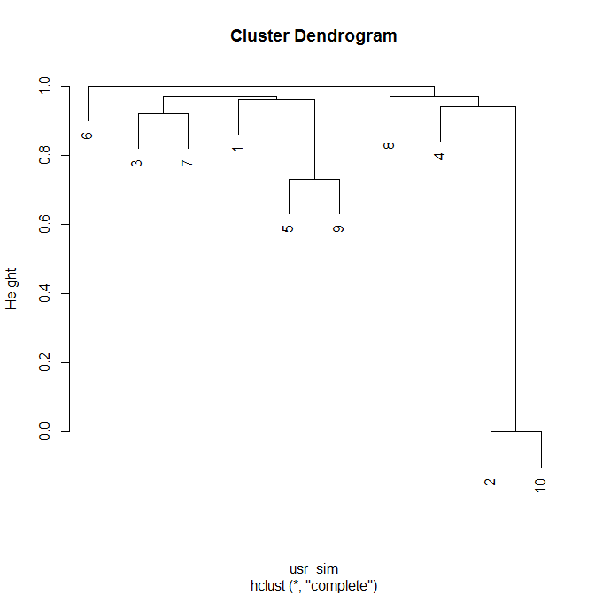

# Unsupervised Learning
Jose Parreno Garcia  
January 2018  
<style>
body {
text-align: justify}

</style>

<br>


```r
library(knitr)
```

In the previous sections we covered regression, classification and some extra advanced algorithms to tackle both of the above. All of these fall under the category of supervised learning, where you have a known response variable to predict. In unsupervised learning a response variable is not needed, and the idea is to present algorithms that will discover patterns only giving the features of the dataset, without a specific goal to classify. In this section we will cover:

* Dimensionality reduction with principal components
* Clustering with Kmeans and principal components
* Clustering tendency and optimum number of clusters
* Hierarchical clustering
* Clustering with affinity propagation
* Recommendation engine

<br>

# Dimensionality reduction with principal components

We are going to look at:

* How PCA works and interpret PCA
* Biplot
* Implementation in R

## How PCA works and interpret PCA

As a rule of thumb, the total information of a dataset is defined by the variability it contained. A very simple example is that, if you only have 1 feature then you will probably have less variability in the information than if you have 10 features. Does that apply the same if we had 1000 features? Generally, by adding more features, we dont necessarily gain more variability, and this variability tends to saturate. The typical examples is correlation. When you have many many features in the dataset, you will probably have some that are correlated with each other, and therefore, using these pairs isn't going to yield much more value than if you only used one of those features. The idea of PCA is trying to explain the variability of the data in fewer variables, in other words, grouping together variables to form another simplified variable called Principal Components.

Lets check a first example to the Boston dataset.

* We use the prcomp function and scale = TRUE
* pca_out shows the loadings used to calculate the principal components. Loadings are like $\beta$ coefficients that are multiplied with each feature to compute the principal component values
* boston_pc contains the actual principal components
* boston_pc has 14 PC, being PC1 the one that explains the maximum variability -> you can see this in the summary(pca_out)
* Summary(pca_out) shows the cummulative variance of the principal components, going from 0.4674 for PC1 up to 1.00 for PC14. As you can see, the more PC14 you add, the less additional gain in variability you will have.


```r
# Load the data
data(Boston, package = "MASS")

# Calculate a simple PCA
pca_out = prcomp(Boston, scale. = T)
pca_out
```

```
## Standard deviations (1, .., p=14):
##  [1] 2.5585132 1.2843410 1.1614241 0.9415625 0.9224421 0.8124105 0.7317177 0.6348831 0.5265582 0.5022524 0.4612919 0.4277704 0.3660733 0.2456149
## 
## Rotation (n x k) = (14 x 14):
##                  PC1          PC2          PC3          PC4          PC5         PC6          PC7         PC8          PC9         PC10         PC11        PC12         PC13         PC14
## crim     0.242284451 -0.065873108  0.395077419 -0.100366211  0.004957659 -0.22462703  0.777083366 -0.15740140  0.254211798 -0.071384615 -0.071068781  0.06327612  0.097032312  0.059114176
## zn      -0.245435005 -0.148002653  0.394545713 -0.342958421  0.114495002 -0.33574694 -0.274178365  0.38031404  0.382899480  0.245579673 -0.127709065 -0.22112210 -0.132375830 -0.096296807
## indus    0.331859746  0.127075668 -0.066081913  0.009626936 -0.022583692 -0.08082495 -0.340273839 -0.17174578  0.627048264 -0.254827026  0.273797614  0.34840828  0.083716854 -0.235472877
## chas    -0.005027133  0.410668763 -0.125305293 -0.700406497 -0.535197817  0.16264906  0.074075775  0.03292700 -0.018642967 -0.041706916 -0.009968402 -0.01903975 -0.049917454  0.023488966
## nox      0.325193880  0.254276363 -0.046475549 -0.053707583  0.194605570 -0.14899191 -0.198092965 -0.04745838 -0.043024391 -0.211620349 -0.437475550 -0.44909357  0.524974687  0.087649148
## rm      -0.202816554  0.434005810  0.353406095  0.293357309 -0.008320481  0.13108056  0.074084938  0.43761566 -0.003666947 -0.526133916  0.223951923 -0.12560554 -0.049893596  0.007190515
## age      0.296976574  0.260303205 -0.200823078  0.078426326  0.149750092 -0.06086960  0.118580363  0.58810569 -0.043265822  0.245647942 -0.329630928  0.48633905 -0.051462562 -0.038227027
## dis     -0.298169809 -0.359149977  0.157068710 -0.184747787 -0.106219480  0.01162335 -0.104397844  0.12823060 -0.175802196 -0.299412026 -0.114600078  0.49356822  0.552292172  0.047124029
## rad      0.303412754  0.031149596  0.418510334  0.051374381 -0.230352185 -0.13493732 -0.137080107 -0.07464872 -0.463439397  0.115793486  0.042213348  0.01863641 -0.006278474 -0.634975332
## tax      0.324033052  0.008851406  0.343232194  0.026810695 -0.163425820 -0.18847146 -0.313984433 -0.07099212 -0.179446555 -0.008366413  0.042794054  0.17042179 -0.242987756  0.698822190
## ptratio  0.207679535 -0.314623061  0.000399092  0.342036328 -0.615707380  0.27901731  0.001485608  0.28346960  0.274525949  0.160474164 -0.099991841 -0.23214842  0.188347079  0.055738160
## black   -0.196638358  0.026481032 -0.361375914  0.201741185 -0.367460674 -0.78590728  0.074842780  0.04444175 -0.060975651 -0.146292237  0.039194858 -0.04152885 -0.021078199 -0.016165280
## lstat    0.311397955 -0.201245177 -0.161060336 -0.242621217  0.178358870 -0.09197211  0.083213083  0.35748247 -0.171810921  0.066647267  0.683032690 -0.18189209  0.249489863  0.083143795
## medv    -0.266636396  0.444924411  0.163188735  0.180297553 -0.050659893 -0.05402804 -0.009964973 -0.15230879  0.070751083  0.575547284  0.242001064  0.09828580  0.469629324  0.134127182
```

```r
# Show actual principal components
boston_pc = pca_out$x
head(boston_pc)
```

```
##         PC1        PC2         PC3        PC4         PC5        PC6       PC7         PC8        PC9          PC10        PC11       PC12       PC13        PC14
## 1 -2.085280  0.4923660 -0.33565863 0.02806062  1.01179950 -0.2618327 0.3275539 -0.16005808 -0.4706823 -0.2055695943 -0.77929505 -0.1095206 -0.4941907  0.24768597
## 2 -1.372024 -0.1707548 -0.96500929 0.43197898  0.25439282  0.3034788 0.5585569  0.28836506 -0.1956362 -0.2459951705 -0.27726872  0.5881189 -0.1129447 -0.11300499
## 3 -2.374204  0.9131235 -0.08993678 1.12280202 -0.03275573  0.5083969 0.4870519 -0.08240874  0.0541731 -0.1948119933  0.02887660  0.4160065  0.3566767  0.05125674
## 4 -2.834974  0.1946773  0.06048549 1.06462885 -0.45987914  0.7133022 0.6227126 -0.23948531 -0.3582658 -0.1557370949 -0.24432275  0.1345659  0.5772376  0.08953590
## 5 -2.770174  0.4328708  0.06397874 1.12852010 -0.38180095  0.6552062 0.7038004  0.10252408 -0.4083493 -0.0004210339  0.00775053  0.2213430  0.7776655  0.14816451
## 6 -2.298644 -0.3283548 -0.44993218 0.69305853 -0.29988892  0.5822707 0.6480631 -0.13247191 -0.4656342  0.1100695972 -0.48317508  0.3511512  0.4333900  0.02416410
```

```r
# Summary of the PC
summary(pca_out)
```

```
## Importance of components%s:
##                           PC1    PC2     PC3     PC4     PC5     PC6     PC7     PC8    PC9    PC10   PC11    PC12    PC13    PC14
## Standard deviation     2.5585 1.2843 1.16142 0.94156 0.92244 0.81241 0.73172 0.63488 0.5266 0.50225 0.4613 0.42777 0.36607 0.24561
## Proportion of Variance 0.4676 0.1178 0.09635 0.06332 0.06078 0.04714 0.03824 0.02879 0.0198 0.01802 0.0152 0.01307 0.00957 0.00431
## Cumulative Proportion  0.4676 0.5854 0.68174 0.74507 0.80585 0.85299 0.89123 0.92003 0.9398 0.95785 0.9730 0.98612 0.99569 1.00000
```

## Biplot

This is the graphical representation of the information shown in the summary, where the x-axis represents the principal components:


```r
plot(pca_out)
```

<!-- -->

The principal components can also help visualise how the features, as well as the observations are related:

* Each number is a row in the dataset
* The red lines are the columns
* The points situated together are more similar
* The columns that are closer to each other are more correlated 
* We will see how to capture those numbers/lines that are similar in the next section.


```r
par(mar=c(4,4,2,2))
biplot(pca_out, cex = 0.5, cex.axis = 0.5)
```

<!-- -->

<br>

# Clustering with Kmeans and principal components

PCA helped us identify those components that explain variability in the data, and would help us select groups of variables that would be most useful for information gain. Kmeans is used to identify classes within the data. We will cover:

* How kmeans works
* Implementation

and visualize the groupings

* How to cluster with principal components

## How kmeans works

Here the steps for the Kmeans algorithm:

* Decide the number of clusters in your data (k) and then pick randomnly centers of those clusters
* Once we have the centers, calculate using a distance metric (lets say the Euclidean distance), the distance between each point and the different centers.
* When we have those distances, the points will grouped with it's closest center location.
* We then recalculate the center of the group with the points we have grouped together, and we will be back to the step of calculating the nearest center.
* This iteration process stops when the points are not being reassigned to any other different grouping or the centers keep at the same location
* SOMETHING TO BE CAREFUL WITH! The final allocation of clusters can differ depending on the initialization of the random clusters. Therefore, it is always a good idea to perform kmeans a number of times and then take, for each point, the majority class that all kmean runs assigned it to.


## Implement and visualize the groupings

Kmeans on iris data:

* We want 3 clusters
* You can see that all points are allocated to those 3 clusters


```r
library(cluster)
set.seed(100)

# We exclude the species column because it doesnt represent numeric data and ask for kmeans to calculate 3 clusters
k_obj = kmeans(iris[,-5],3)
k_obj
```

```
## K-means clustering with 3 clusters of sizes 33, 21, 96
## 
## Cluster means:
##   Sepal.Length Sepal.Width Petal.Length Petal.Width
## 1     5.175758    3.624242     1.472727   0.2727273
## 2     4.738095    2.904762     1.790476   0.3523810
## 3     6.314583    2.895833     4.973958   1.7031250
## 
## Clustering vector:
##   [1] 1 2 2 2 1 1 1 1 2 2 1 1 2 2 1 1 1 1 1 1 1 1 1 1 2 2 1 1 1 2 2 1 1 1 2 1 1 1 2 1 1 2 2 1 1 2 1 2 1 1 3 3 3 3 3 3 3 2 3 3 2 3 3 3 3 3 3 3 3 3 3 3 3 3 3 3 3 3 3 3 3 3 3 3 3 3 3 3 3 3 3 3 3 2 3 3 3 3 2 3 3 3 3 3 3 3 3 3 3 3 3 3 3 3 3 3 3 3 3 3 3 3
## [123] 3 3 3 3 3 3 3 3 3 3 3 3 3 3 3 3 3 3 3 3 3 3 3 3 3 3 3 3
## 
## Within cluster sum of squares by cluster:
## [1]   6.432121  17.669524 118.651875
##  (between_SS / total_SS =  79.0 %)
## 
## Available components:
## 
## [1] "cluster"      "centers"      "totss"        "withinss"     "tot.withinss" "betweenss"    "size"         "iter"         "ifault"
```

## How to cluster with principal components

Since the iris dataset has more than 2 variables, lets see if we can use this as a simple example of clustering with principal components. We will also try to plot the components of PCA1 and PCA2:

* First we calculate principal components
* As you can see from the summary, the first 2 components pretty much offer all the variability we will get from the data.
* pcas shows how we predict, for each record, the classes using the different PCs. We would expect PC1 and PC2 to predict with better results than PC3 and PC4. To check this we can plot the results
* In the plot, you can see there is a distinct separation between the setosa class and the other 2, however, versicolor and virginica seems to fall in the same group. This is quite not satisfactory. Probably, this might be because, with the data we used, there is no distinct separation between these 2 groups.


```r
# Calculate principal components
pcmod = prcomp(iris[,-5], scale = T)
summary(pcmod)
```

```
## Importance of components%s:
##                           PC1    PC2     PC3     PC4
## Standard deviation     1.7084 0.9560 0.38309 0.14393
## Proportion of Variance 0.7296 0.2285 0.03669 0.00518
## Cumulative Proportion  0.7296 0.9581 0.99482 1.00000
```

```r
# We use the information from the PC to predict with them the classes of the whole data
pcas = predict(pcmod)
head(pcas)
```

```
##            PC1        PC2         PC3          PC4
## [1,] -2.257141 -0.4784238  0.12727962  0.024087508
## [2,] -2.074013  0.6718827  0.23382552  0.102662845
## [3,] -2.356335  0.3407664 -0.04405390  0.028282305
## [4,] -2.291707  0.5953999 -0.09098530 -0.065735340
## [5,] -2.381863 -0.6446757 -0.01568565 -0.035802870
## [6,] -2.068701 -1.4842053 -0.02687825  0.006586116
```

```r
# Given that we are interested in PC1 and PC2, we plot the results and the k-clusters
plot(pcas[,1],pcas[,2], col = k_obj$cluster)
text(pcas[,1],pcas[,2], iris$Species, cex = 0.5)
```

<!-- -->

## Clustering with kmeans the PCAs rather than original data

How can we rectifiy this? A possible solution is to cluster into those 3 groups based on the principal components of iris rather than the original data.

* As you can see from the plot, clustering based on the PCA seemed to have done the job!
* The only downside, is that we have gone through a process of MANUALLY providing the number of clusters to kmeans, therefore, needing an understanding of the data beforehand. The next section will try to cover how to extract the optimal number of clusters, when there is little knowledge of the data


```r
# PCAs
pcmod = prcomp(iris[,-5], scale = T)
pcas = predict(pcmod)

# Cluster
k_pca = kmeans(pcas, 3)

# Plot
plot(pcas[,1], pcas[,2], col = k_pca$cluster)
text(pcas[,1], pcas[,2], iris$Species, cex = 0.5)
```

<!-- -->

```r
# Table
table(k_pca$cluster, iris$Species)
```

```
##    
##     setosa versicolor virginica
##   1     50          0         0
##   2      0         39        14
##   3      0         11        36
```

<br>

# Clustering tendency and optimum number of clusters

As said just above, sometimes in real world applications, we might not know how many clusters we need or want to segment our data, so it can be helpful if we can do this automatically. We will see:

* Clustering tendency
* How to visualise it
* Finding optimum number of clusters

## Clustering tendency

In order to measure clustering tendency, we can look at basing this on **Hopkins Statistic**, which measures the probability that a given dataset is generated from random data points. So, the lower the Hopskings statistic, the lower the chance that the observations are spread uniformly.


Lets compute the Hopkins statistic for the iris dataset. As you can see below, the Hopkins statistic is ~18%, so we could say that the data points are not random.


```r
library(clustertend)
hopkins(iris[, -5], n = (nrow(iris)-1))
```

```
## $H
## [1] 0.1785227
```

Lets visualize the clustering tendency with a diss-plot and a random matrix of generated numbers. Given that we created random numbers, we expect no patterns to be created, and the dissplot shows this. Doing the same for the iris dataset, the dissplot shows clearly, 2 distinct groups. It also seems like, within the big groups, there are some different shades of grey indicating smaller subgroups within the same big group.


```r
library(seriation)

# Random matrix and plot
set.seed(100)
rand_mat = matrix(runif(1000), nrow = 100)
dissplot(dist(rand_mat), main = "Clustering Tendency: dissplot")
```

<!-- -->

```r
# Iris plot -> we pass the distance metric matrix to the dissplot function
df_dist = dist(iris[,-5])
dissplot(df_dist, main = "Clustering Tendency: dissplot")
```

<!-- -->

## Selecting the optimum number of clusters

To do this we will use the **Silhouette Width**. Silhouette width can be used to measure how well separated the clusters are. In general, the more the separation the better the clustering, but this principle might not always be relevant as there could be groups that are structurally similar, so you should always apply a bit of common sense to this analysis.


```r
# Loading the data
data(ruspini, package = "cluster")
x = ruspini

# Hopkins statistic 
hopkins(ruspini, n = nrow(ruspini)-1)
```

```
## $H
## [1] 0.2283923
```

```r
# Dissplot -> shows possible 4 clusters
dissplot(dist(ruspini))
```

<!-- -->

```r
# Initialize output of silhouette width
avg_sil_wid = numeric(nrow(x)/2)

# Run kmeans with different values and compute the silhouette width. The k with highest silhouette width, is likely to be the best
for(nclus in 2:(nrow(x)/2)){
  set.seed(100) # for repeatability
  kout = kmeans(x, nclus) # run kmeans with different number of clusters
  ss = silhouette(kout$cluster, dist(x)) # create a Silhouette plot
  avg_sil_wid[nclus] = mean(ss[, 3]) # saving the results
}

opt_cluster = which.max(avg_sil_wid)
opt_cluster
```

```
## [1] 4
```

```r
# Let plot this.
par(mar = c(5,2,3,1))
plot(1:(nrow(x)/2)
     , avg_sil_wid
     , type = "b"
     , pch = 19
     , frame = T
     , xlab = "Number of clusters k"
     , ylab = "AvgSilWid"
     , main = "Optimal clusters - yaxis = average silhouette width")
points(x = opt_cluster
       , y = max(avg_sil_wid)
       , col = "red"
       , pch = 21
       , cex = 3)
abline(v = which.max(avg_sil_wid), lty = 2)
```

<!-- -->

```r
# Plotting points in a chart for the best selected cluster
set.seed(100)
kout = kmeans(x, 4)
plot(ruspini, col = kout$cluster)
```

<!-- -->

<br>

# Hierarchical clustering

Clustering can also be computed and visualized as a hierarchy as well. We will see:

* How hierarchical clustering works
* Dendograms

## How hierarchical clustering works

Broadly, there are 2 type of hierarchical clustering:

* Agglomerative: (bottom-up) Starting with each ite in its own cluster, find the best pair to merge into a new cluster and repeat until all clusters are fused together
* Divise: (top-down) Starting with all the data in a single cluster, consider every possible way to divide the cluster into 2. Choose the best division and recursiely operated on both sides.
* Both approaches are based on calculating the similarity between clusters based on distances. The way distances are computed could be based on links:


## Implementation in R with seeds dataset

Lets use the seeds dataset from the UCI machine learning repo. In order to perform hierarchical clustering, we need to compute the distance matrix and then pass it to the **hclust** function.


```r
# Load data
data = read.table("https://archive.ics.uci.edu/ml/machine-learning-databases/00236/seeds_dataset.txt", header = F, fill = T)
colnames(data) = c("area","perimeter","compactness","length_of_kernel","width_of_kernel","asymmetry_coefficient","length_of_kernel_groove","type")

# Distance matrix
dist_mat = dist(data[,-8])

# Hierarchical clustering
h = hclust(dist_mat)
h
```

```
## 
## Call:
## hclust(d = dist_mat)
## 
## Cluster method   : complete 
## Distance         : Euclidean 
## Number of objects: 210
```

```r
# Plotting hierarchical clustering
plot(h, cex = 0.75, labels = data$type)

# Adding 3 clustered rectangles with different colours
rect.hclust(h, k = 3, border = 2:4)
```

<!-- -->

```r
# After having creating the clustering, assign each observation to its cluster
pred = cutree(h, k = 3)
pred
```

```
##   [1] 1 1 1 1 1 1 1 1 1 1 1 1 1 1 1 1 2 1 1 2 1 1 1 2 1 1 2 2 1 1 2 1 1 1 1 1 1 1 1 2 2 2 2 1 1 1 1 1 1 1 1 1 1 1 1 1 1 1 1 2 2 2 2 2 2 2 1 1 1 2 1 1 1 3 1 1 1 3 3 1 1 3 3 3 3 3 3 3 3 3 3 3 3 3 3 1 3 3 3 3 1 3 3 3 3 3 3 1 3 3 3 3 3 3 3 3 3 3 3 3 3 1
## [123] 1 3 1 3 3 3 3 1 3 3 1 1 1 1 1 1 1 1 2 2 2 2 2 2 2 2 2 2 2 2 2 2 2 2 2 2 2 2 2 2 2 2 2 2 2 2 2 2 2 2 2 2 2 2 2 2 2 2 2 2 2 2 2 2 2 2 2 2 2 2 2 2 2 2 2 2 2 2 2 2 2 2 2 2 2 2 2 2
```

## Implementation in R with iris dataset


```r
# Distance matrix
dist_mat = dist(iris[,-5])

# Hierarchical clustering
h = hclust(dist_mat, method = "ward.D")
h
```

```
## 
## Call:
## hclust(d = dist_mat, method = "ward.D")
## 
## Cluster method   : ward.D 
## Distance         : Euclidean 
## Number of objects: 150
```

```r
# Plotting hierarchical clustering
plot(h)

# Adding 3 clustered rectangles with different colours
rect.hclust(h, k = 3, border = 2:4)
```

<!-- -->

```r
# After having creating the clustering, assign each observation to its cluster
pred = cutree(h, k = 3)
pred
```

```
##   [1] 1 1 1 1 1 1 1 1 1 1 1 1 1 1 1 1 1 1 1 1 1 1 1 1 1 1 1 1 1 1 1 1 1 1 1 1 1 1 1 1 1 1 1 1 1 1 1 1 1 1 2 2 2 2 2 2 2 2 2 2 2 2 2 2 2 2 2 2 2 2 2 2 2 2 2 2 2 2 2 2 2 2 2 2 2 2 2 2 2 2 2 2 2 2 2 2 2 2 2 2 3 2 3 3 3 3 2 3 3 3 3 3 3 2 2 3 3 3 3 2 3 2
## [123] 3 2 3 3 2 2 3 3 3 3 3 2 3 3 3 3 2 3 3 3 2 3 3 3 2 3 3 2
```

```r
table(pred, iris$Species)
```

```
##     
## pred setosa versicolor virginica
##    1     50          0         0
##    2      0         50        14
##    3      0          0        36
```

# Clustering with affinity propagation

An important difference between k-mean and affinity propagation is that in kmeans we start with a predefined number of clusters and randomnly initially choose the centers, running this multiple times to define the groupings. In affinity propagation every point is a potential center, also called examplers. The points kind of send messaged to each other and align themselves creating local clusters. This situation of sending messages continues, because points dont want the responsibility of being the exampler, so they look for others to share this, creating more stable and bigger clusters.

## Implementation in R with seeds dataset


```r
library(apcluster)

# Read data
data = read.table("https://archive.ics.uci.edu/ml/machine-learning-databases/00236/seeds_dataset.txt", header = F, fill = T)

colnames(data) = c("area","perimeter","compactness","length_of_kernel","width_of_kernel","asymmetry_coefficient","length_of_kernel_groove","type")

head(data)
```

```
##    area perimeter compactness length_of_kernel width_of_kernel asymmetry_coefficient length_of_kernel_groove type
## 1 15.26     14.84      0.8710            5.763           3.312                 2.221                   5.220    1
## 2 14.88     14.57      0.8811            5.554           3.333                 1.018                   4.956    1
## 3 14.29     14.09      0.9050            5.291           3.337                 2.699                   4.825    1
## 4 13.84     13.94      0.8955            5.324           3.379                 2.259                   4.805    1
## 5 16.14     14.99      0.9034            5.658           3.562                 1.355                   5.175    1
## 6 14.38     14.21      0.8951            5.386           3.312                 2.462                   4.956    1
```

The apcluster function takes a similarity matrix as the main input, so we need to first calculate this. There are multiple options you could use to compute this:

* Negative similarity matrix --> negDistMat(data[, -8], r = 2)
* Exponential similarity matrix --> expSimMat(data[, -8], r = 2, w = 1, method = "euclidean")
* Linear similarity matrix --> linSimMat(data[, 8], w = 1, method = "euclidean")
* Correlation pairwise similarity matrix --> corSimMat(data[, -8], r = 1, signed = TRUE)


```r
# Similarity matrix -> negative distance matrix: it computes the negative similarities of all 210 observations.
# The "r" argument computes the power of the computed distances (in this square distances).
neg_sim_mat = negDistMat(data[, -8], r = 2)

# Compute the clusters
clus = apcluster(neg_sim_mat)
cl = clus@clusters # get the clusters
xmplrs = clus@exemplars # get the exemplars

# The dataset shows that we have 11 clusters! The only thing is that we need to convert clusters and exemplars into a "consumable" format.
clus
```

```
## 
## APResult object
## 
## Number of samples     =  210 
## Number of iterations  =  144 
## Input preference      =  -16.40538 
## Sum of similarities   =  -200.5588 
## Sum of preferences    =  -180.4592 
## Net similarity        =  -381.018 
## Number of clusters    =  11 
## 
## Exemplars:
##    28 54 59 75 83 100 105 142 174 182 209
## Clusters:
##    Cluster 1, exemplar 28:
##       4 24 27 28 31 41 42 43 46 60 65 66 70 149 161 166 180 199 200 202
##    Cluster 2, exemplar 54:
##       3 6 7 8 11 13 14 15 16 21 22 29 30 32 33 34 39 45 48 49 51 53 54 57 68 136
##    Cluster 3, exemplar 59:
##       1 2 5 9 10 12 18 19 23 25 26 35 36 37 47 50 55 56 58 59 67 69 125 138 139
##    Cluster 4, exemplar 75:
##       38 44 52 71 72 73 75 76 77 80 81 96 101 108 123 130 133 134 135 137 140
##    Cluster 5, exemplar 83:
##       78 79 82 83 89 90 94 114 115 121
##    Cluster 6, exemplar 100:
##       84 86 87 91 98 99 100 102 106 110 111 113 116 128 129 131
##    Cluster 7, exemplar 105:
##       74 85 88 92 93 95 97 103 104 105 107 109 112 117 118 119 120 122 124 126 127 132
##    Cluster 8, exemplar 142:
##       40 142 143 152 185 204 208
##    Cluster 9, exemplar 174:
##       146 150 151 156 160 165 171 172 174 175 176 177 178 179 181 184 189 190 191 194
##    Cluster 10, exemplar 182:
##       17 20 64 141 144 145 148 153 158 163 164 167 182 183 187 196 197 198 201 210
##    Cluster 11, exemplar 209:
##       61 62 63 147 154 155 157 159 162 168 169 170 173 186 188 192 193 195 203 205 206 207 209
```


```r
# Getting results into a dataframe --> basically we want to attach to the original dataset the corresponding clusters we just computed

tidy_clus = function(cl){
  
  # Assign names
  names(cl) = paste0("cl", 1:length(cl))
  
  # Function to get the observation and cluster number in a dataframe
  getCl = function(x){
    data.frame(id = cl[[x]], cluster = rep(x, length(cl[[x]])))
  }
  
  # Get the observation and cluster number
  groups_list = lapply(names(cl), getCl)
  groups_df = Reduce(rbind, groups_list)
  groups = groups_df[order(groups_df$id),]
  print(groups)
}

groups = tidy_clus(cl)
```

```
##      id cluster
## 1     1     cl3
## 2     2     cl3
## 3     3     cl2
## 4     4     cl1
## 5     5     cl3
## 6     6     cl2
## 7     7     cl2
## 8     8     cl2
## 9     9     cl3
## 10   10     cl3
## 11   11     cl2
## 12   12     cl3
## 13   13     cl2
## 14   14     cl2
## 15   15     cl2
## 16   16     cl2
## 17   17    cl10
## 18   18     cl3
## 19   19     cl3
## 20   20    cl10
## 21   21     cl2
## 22   22     cl2
## 23   23     cl3
## 24   24     cl1
## 25   25     cl3
## 26   26     cl3
## 27   27     cl1
## 28   28     cl1
## 29   29     cl2
## 30   30     cl2
## 31   31     cl1
## 32   32     cl2
## 33   33     cl2
## 34   34     cl2
## 35   35     cl3
## 36   36     cl3
## 37   37     cl3
## 38   38     cl4
## 39   39     cl2
## 40   40     cl8
## 41   41     cl1
## 42   42     cl1
## 43   43     cl1
## 44   44     cl4
## 45   45     cl2
## 46   46     cl1
## 47   47     cl3
## 48   48     cl2
## 49   49     cl2
## 50   50     cl3
## 51   51     cl2
## 52   52     cl4
## 53   53     cl2
## 54   54     cl2
## 55   55     cl3
## 56   56     cl3
## 57   57     cl2
## 58   58     cl3
## 59   59     cl3
## 60   60     cl1
## 61   61    cl11
## 62   62    cl11
## 63   63    cl11
## 64   64    cl10
## 65   65     cl1
## 66   66     cl1
## 67   67     cl3
## 68   68     cl2
## 69   69     cl3
## 70   70     cl1
## 71   71     cl4
## 72   72     cl4
## 73   73     cl4
## 74   74     cl7
## 75   75     cl4
## 76   76     cl4
## 77   77     cl4
## 78   78     cl5
## 79   79     cl5
## 80   80     cl4
## 81   81     cl4
## 82   82     cl5
## 83   83     cl5
## 84   84     cl6
## 85   85     cl7
## 86   86     cl6
## 87   87     cl6
## 88   88     cl7
## 89   89     cl5
## 90   90     cl5
## 91   91     cl6
## 92   92     cl7
## 93   93     cl7
## 94   94     cl5
## 95   95     cl7
## 96   96     cl4
## 97   97     cl7
## 98   98     cl6
## 99   99     cl6
## 100 100     cl6
## 101 101     cl4
## 102 102     cl6
## 103 103     cl7
## 104 104     cl7
## 105 105     cl7
## 106 106     cl6
## 107 107     cl7
## 108 108     cl4
## 109 109     cl7
## 110 110     cl6
## 111 111     cl6
## 112 112     cl7
## 113 113     cl6
## 114 114     cl5
## 115 115     cl5
## 116 116     cl6
## 117 117     cl7
## 118 118     cl7
## 119 119     cl7
## 120 120     cl7
## 121 121     cl5
## 122 122     cl7
## 123 123     cl4
## 124 124     cl7
## 125 125     cl3
## 126 126     cl7
## 127 127     cl7
## 128 128     cl6
## 129 129     cl6
## 130 130     cl4
## 131 131     cl6
## 132 132     cl7
## 133 133     cl4
## 134 134     cl4
## 135 135     cl4
## 136 136     cl2
## 137 137     cl4
## 138 138     cl3
## 139 139     cl3
## 140 140     cl4
## 141 141    cl10
## 142 142     cl8
## 143 143     cl8
## 144 144    cl10
## 145 145    cl10
## 146 146     cl9
## 147 147    cl11
## 148 148    cl10
## 149 149     cl1
## 150 150     cl9
## 151 151     cl9
## 152 152     cl8
## 153 153    cl10
## 154 154    cl11
## 155 155    cl11
## 156 156     cl9
## 157 157    cl11
## 158 158    cl10
## 159 159    cl11
## 160 160     cl9
## 161 161     cl1
## 162 162    cl11
## 163 163    cl10
## 164 164    cl10
## 165 165     cl9
## 166 166     cl1
## 167 167    cl10
## 168 168    cl11
## 169 169    cl11
## 170 170    cl11
## 171 171     cl9
## 172 172     cl9
## 173 173    cl11
## 174 174     cl9
## 175 175     cl9
## 176 176     cl9
## 177 177     cl9
## 178 178     cl9
## 179 179     cl9
## 180 180     cl1
## 181 181     cl9
## 182 182    cl10
## 183 183    cl10
## 184 184     cl9
## 185 185     cl8
## 186 186    cl11
## 187 187    cl10
## 188 188    cl11
## 189 189     cl9
## 190 190     cl9
## 191 191     cl9
## 192 192    cl11
## 193 193    cl11
## 194 194     cl9
## 195 195    cl11
## 196 196    cl10
## 197 197    cl10
## 198 198    cl10
## 199 199     cl1
## 200 200     cl1
## 201 201    cl10
## 202 202     cl1
## 203 203    cl11
## 204 204     cl8
## 205 205    cl11
## 206 206    cl11
## 207 207    cl11
## 208 208     cl8
## 209 209    cl11
## 210 210    cl10
```

```r
# Attaching to original dataset
data_x = cbind(data, groups)
head(data_x)
```

```
##    area perimeter compactness length_of_kernel width_of_kernel asymmetry_coefficient length_of_kernel_groove type id cluster
## 1 15.26     14.84      0.8710            5.763           3.312                 2.221                   5.220    1  1     cl3
## 2 14.88     14.57      0.8811            5.554           3.333                 1.018                   4.956    1  2     cl3
## 3 14.29     14.09      0.9050            5.291           3.337                 2.699                   4.825    1  3     cl2
## 4 13.84     13.94      0.8955            5.324           3.379                 2.259                   4.805    1  4     cl1
## 5 16.14     14.99      0.9034            5.658           3.562                 1.355                   5.175    1  5     cl3
## 6 14.38     14.21      0.8951            5.386           3.312                 2.462                   4.956    1  6     cl2
```

Let's check some of the results. Clearly, we have more clusters than seed types!!!! That is actually fine, we can keep this as it is if we wanted to, but we could also merge some of the clusters together.


```r
# More clusters than types
t1 = table(data_x$type, data_x$cluster)
t1
```

```
##    
##     cl1 cl2 cl3 cl4 cl5 cl6 cl7 cl8 cl9 cl10 cl11
##   1  13  25  22   3   0   0   0   1   0    3    3
##   2   0   1   3  18  10  16  22   0   0    0    0
##   3   7   0   0   0   0   0   0   6  20   17   20
```

```r
# Aggregating clusters --> for example, cl1, cl2, cl3 seem to have the vast majority of the type = 1.
# Possible grouping
clus_agg = aggExCluster(s = neg_sim_mat, x = clus)
plot(clus_agg)
```

<!-- -->

```r
# Specify number of clusters
clus_agg_4 = cutree(clus_agg, k = 3)
clus_agg_4
```

```
## 
## ExClust object
## 
## Number of samples   =  210 
## Number of clusters  =  3 
## 
## Exemplars:
##    6 163 122
## Clusters:
##    Cluster 1, exemplar 6:
##       4 24 27 28 31 41 42 43 46 60 65 66 70 149 161 166 180 199 200 202 3 6 7 8 11 13 14 15 16 21 22 29 30 32 33 34 39 45 48 49 51 53 54 57 68 136 1 2 5 9 10 12 18 19 23 25 26 35 36 37 47 50 55 56 58 59 67 69 125 138 139
##    Cluster 2, exemplar 163:
##       40 142 143 152 185 204 208 146 150 151 156 160 165 171 172 174 175 176 177 178 179 181 184 189 190 191 194 17 20 64 141 144 145 148 153 158 163 164 167 182 183 187 196 197 198 201 210 61 62 63 147 154 155 157 159 162 168 169 170 173 186 188 
##       192 193 195 203 205 206 207 209
##    Cluster 3, exemplar 122:
##       78 79 82 83 89 90 94 114 115 121 38 44 52 71 72 73 75 76 77 80 81 96 101 108 123 130 133 134 135 137 140 84 86 87 91 98 99 100 102 106 110 111 113 116 128 129 131 74 85 88 92 93 95 97 103 104 105 107 109 112 117 118 119 120 122 124 126 127 132
```

```r
groups2 = tidy_clus(cl = clus_agg_4@clusters)
```

```
##      id cluster
## 1     1     cl1
## 2     2     cl1
## 3     3     cl1
## 4     4     cl1
## 5     5     cl1
## 6     6     cl1
## 7     7     cl1
## 8     8     cl1
## 9     9     cl1
## 10   10     cl1
## 11   11     cl1
## 12   12     cl1
## 13   13     cl1
## 14   14     cl1
## 15   15     cl1
## 16   16     cl1
## 17   17     cl2
## 18   18     cl1
## 19   19     cl1
## 20   20     cl2
## 21   21     cl1
## 22   22     cl1
## 23   23     cl1
## 24   24     cl1
## 25   25     cl1
## 26   26     cl1
## 27   27     cl1
## 28   28     cl1
## 29   29     cl1
## 30   30     cl1
## 31   31     cl1
## 32   32     cl1
## 33   33     cl1
## 34   34     cl1
## 35   35     cl1
## 36   36     cl1
## 37   37     cl1
## 38   38     cl3
## 39   39     cl1
## 40   40     cl2
## 41   41     cl1
## 42   42     cl1
## 43   43     cl1
## 44   44     cl3
## 45   45     cl1
## 46   46     cl1
## 47   47     cl1
## 48   48     cl1
## 49   49     cl1
## 50   50     cl1
## 51   51     cl1
## 52   52     cl3
## 53   53     cl1
## 54   54     cl1
## 55   55     cl1
## 56   56     cl1
## 57   57     cl1
## 58   58     cl1
## 59   59     cl1
## 60   60     cl1
## 61   61     cl2
## 62   62     cl2
## 63   63     cl2
## 64   64     cl2
## 65   65     cl1
## 66   66     cl1
## 67   67     cl1
## 68   68     cl1
## 69   69     cl1
## 70   70     cl1
## 71   71     cl3
## 72   72     cl3
## 73   73     cl3
## 74   74     cl3
## 75   75     cl3
## 76   76     cl3
## 77   77     cl3
## 78   78     cl3
## 79   79     cl3
## 80   80     cl3
## 81   81     cl3
## 82   82     cl3
## 83   83     cl3
## 84   84     cl3
## 85   85     cl3
## 86   86     cl3
## 87   87     cl3
## 88   88     cl3
## 89   89     cl3
## 90   90     cl3
## 91   91     cl3
## 92   92     cl3
## 93   93     cl3
## 94   94     cl3
## 95   95     cl3
## 96   96     cl3
## 97   97     cl3
## 98   98     cl3
## 99   99     cl3
## 100 100     cl3
## 101 101     cl3
## 102 102     cl3
## 103 103     cl3
## 104 104     cl3
## 105 105     cl3
## 106 106     cl3
## 107 107     cl3
## 108 108     cl3
## 109 109     cl3
## 110 110     cl3
## 111 111     cl3
## 112 112     cl3
## 113 113     cl3
## 114 114     cl3
## 115 115     cl3
## 116 116     cl3
## 117 117     cl3
## 118 118     cl3
## 119 119     cl3
## 120 120     cl3
## 121 121     cl3
## 122 122     cl3
## 123 123     cl3
## 124 124     cl3
## 125 125     cl1
## 126 126     cl3
## 127 127     cl3
## 128 128     cl3
## 129 129     cl3
## 130 130     cl3
## 131 131     cl3
## 132 132     cl3
## 133 133     cl3
## 134 134     cl3
## 135 135     cl3
## 136 136     cl1
## 137 137     cl3
## 138 138     cl1
## 139 139     cl1
## 140 140     cl3
## 141 141     cl2
## 142 142     cl2
## 143 143     cl2
## 144 144     cl2
## 145 145     cl2
## 146 146     cl2
## 147 147     cl2
## 148 148     cl2
## 149 149     cl1
## 150 150     cl2
## 151 151     cl2
## 152 152     cl2
## 153 153     cl2
## 154 154     cl2
## 155 155     cl2
## 156 156     cl2
## 157 157     cl2
## 158 158     cl2
## 159 159     cl2
## 160 160     cl2
## 161 161     cl1
## 162 162     cl2
## 163 163     cl2
## 164 164     cl2
## 165 165     cl2
## 166 166     cl1
## 167 167     cl2
## 168 168     cl2
## 169 169     cl2
## 170 170     cl2
## 171 171     cl2
## 172 172     cl2
## 173 173     cl2
## 174 174     cl2
## 175 175     cl2
## 176 176     cl2
## 177 177     cl2
## 178 178     cl2
## 179 179     cl2
## 180 180     cl1
## 181 181     cl2
## 182 182     cl2
## 183 183     cl2
## 184 184     cl2
## 185 185     cl2
## 186 186     cl2
## 187 187     cl2
## 188 188     cl2
## 189 189     cl2
## 190 190     cl2
## 191 191     cl2
## 192 192     cl2
## 193 193     cl2
## 194 194     cl2
## 195 195     cl2
## 196 196     cl2
## 197 197     cl2
## 198 198     cl2
## 199 199     cl1
## 200 200     cl1
## 201 201     cl2
## 202 202     cl1
## 203 203     cl2
## 204 204     cl2
## 205 205     cl2
## 206 206     cl2
## 207 207     cl2
## 208 208     cl2
## 209 209     cl2
## 210 210     cl2
```

```r
data_xx = cbind(data, groups2)

# Checking the table
t2 = table(data_xx$type, data_xx$cluster)
t2
```

```
##    
##     cl1 cl2 cl3
##   1  60   7   3
##   2   4   0  66
##   3   7  63   0
```

## PCA and clustering with affinity propagation


```r
data(iris)

# Get PCA
pca_iris_mod = princomp(iris[, -5])
screeplot(pca_iris_mod, type = "lines")
```

<!-- -->

```r
pca_iris = predict(pca_iris_mod)
head(pca_iris)
```

```
##         Comp.1     Comp.2      Comp.3       Comp.4
## [1,] -2.684126 -0.3193972 -0.02791483  0.002262437
## [2,] -2.714142  0.1770012 -0.21046427  0.099026550
## [3,] -2.888991  0.1449494  0.01790026  0.019968390
## [4,] -2.745343  0.3182990  0.03155937 -0.075575817
## [5,] -2.728717 -0.3267545  0.09007924 -0.061258593
## [6,] -2.280860 -0.7413304  0.16867766 -0.024200858
```

```r
# run AP clusters for predefined k clusters
iris_clus = apclusterK(negDistMat(r = 2), pca_iris[,1:2], K = 3, prc = 0)
```

```
## Trying p = -0.6777979 
##    Number of clusters: 16 
## Trying p = -6.777979 
##    Number of clusters: 5 
## Trying p = -67.77979 
##    Number of clusters: 3 
## 
## Number of clusters: 3 for p = -67.77979
```

```r
cl = iris_clus@clusters
xmplrs = iris_clus@exemplars

# Tidy clusters and append to iris dataset
grps = tidy_clus(cl)
```

```
##      id cluster
## 1     1     cl1
## 2     2     cl1
## 3     3     cl1
## 4     4     cl1
## 5     5     cl1
## 6     6     cl1
## 7     7     cl1
## 8     8     cl1
## 9     9     cl1
## 10   10     cl1
## 11   11     cl1
## 12   12     cl1
## 13   13     cl1
## 14   14     cl1
## 15   15     cl1
## 16   16     cl1
## 17   17     cl1
## 18   18     cl1
## 19   19     cl1
## 20   20     cl1
## 21   21     cl1
## 22   22     cl1
## 23   23     cl1
## 24   24     cl1
## 25   25     cl1
## 26   26     cl1
## 27   27     cl1
## 28   28     cl1
## 29   29     cl1
## 30   30     cl1
## 31   31     cl1
## 32   32     cl1
## 33   33     cl1
## 34   34     cl1
## 35   35     cl1
## 36   36     cl1
## 37   37     cl1
## 38   38     cl1
## 39   39     cl1
## 40   40     cl1
## 41   41     cl1
## 42   42     cl1
## 43   43     cl1
## 44   44     cl1
## 45   45     cl1
## 46   46     cl1
## 47   47     cl1
## 48   48     cl1
## 49   49     cl1
## 50   50     cl1
## 51   51     cl3
## 52   52     cl2
## 53   53     cl3
## 54   54     cl2
## 55   55     cl2
## 56   56     cl2
## 57   57     cl2
## 58   58     cl2
## 59   59     cl2
## 60   60     cl2
## 61   61     cl2
## 62   62     cl2
## 63   63     cl2
## 64   64     cl2
## 65   65     cl2
## 66   66     cl2
## 67   67     cl2
## 68   68     cl2
## 69   69     cl2
## 70   70     cl2
## 71   71     cl2
## 72   72     cl2
## 73   73     cl2
## 74   74     cl2
## 75   75     cl2
## 76   76     cl2
## 77   77     cl3
## 78   78     cl3
## 79   79     cl2
## 80   80     cl2
## 81   81     cl2
## 82   82     cl2
## 83   83     cl2
## 84   84     cl2
## 85   85     cl2
## 86   86     cl2
## 87   87     cl2
## 88   88     cl2
## 89   89     cl2
## 90   90     cl2
## 91   91     cl2
## 92   92     cl2
## 93   93     cl2
## 94   94     cl2
## 95   95     cl2
## 96   96     cl2
## 97   97     cl2
## 98   98     cl2
## 99   99     cl2
## 100 100     cl2
## 101 101     cl3
## 102 102     cl2
## 103 103     cl3
## 104 104     cl3
## 105 105     cl3
## 106 106     cl3
## 107 107     cl2
## 108 108     cl3
## 109 109     cl3
## 110 110     cl3
## 111 111     cl3
## 112 112     cl3
## 113 113     cl3
## 114 114     cl2
## 115 115     cl2
## 116 116     cl3
## 117 117     cl3
## 118 118     cl3
## 119 119     cl3
## 120 120     cl2
## 121 121     cl3
## 122 122     cl2
## 123 123     cl3
## 124 124     cl2
## 125 125     cl3
## 126 126     cl3
## 127 127     cl2
## 128 128     cl2
## 129 129     cl3
## 130 130     cl3
## 131 131     cl3
## 132 132     cl3
## 133 133     cl3
## 134 134     cl3
## 135 135     cl3
## 136 136     cl3
## 137 137     cl3
## 138 138     cl3
## 139 139     cl2
## 140 140     cl3
## 141 141     cl3
## 142 142     cl3
## 143 143     cl2
## 144 144     cl3
## 145 145     cl3
## 146 146     cl3
## 147 147     cl2
## 148 148     cl3
## 149 149     cl3
## 150 150     cl2
```

```r
iris_x = cbind(iris, grps)
iris_x$species_abbr = abbreviate(iris_x$Species, 1)
head(iris_x)
```

```
##   Sepal.Length Sepal.Width Petal.Length Petal.Width Species id cluster species_abbr
## 1          5.1         3.5          1.4         0.2  setosa  1     cl1            s
## 2          4.9         3.0          1.4         0.2  setosa  2     cl1            s
## 3          4.7         3.2          1.3         0.2  setosa  3     cl1            s
## 4          4.6         3.1          1.5         0.2  setosa  4     cl1            s
## 5          5.0         3.6          1.4         0.2  setosa  5     cl1            s
## 6          5.4         3.9          1.7         0.4  setosa  6     cl1            s
```

```r
# Plot
# - Colour of the point represents the predicted class
# - Text represents the actual class
# - There are some mismatches
plot(pca_iris[, 1:2], col = iris_x$cluster, pch = "*", main = "Iris - AP Cluster")
points(pca_iris[xmplrs, 1], pca_iris[xmplrs, 2], col = iris_x[xmplrs, "cluster"], cex = 1.5)
text(pca_iris[, 1], pca_iris[, 2]-0.1, labels = iris_x$species_abbr, cex = 0.5
     , col = as.numeric(as.factor(iris_x$Species)))
```

<!-- -->

# Recommendation engines

We will briefly look at:

* Inputs to recommendation algorithms and different approaches
* How to find similar customers
* How to find similar products

## Inputs to recommendation algorithms and different approaches

Typical inputs to products can take multiple forms, for example, opinions from users, some sort of action, etc. As an example, check the image below.


If you see the image above, the matrix shows how could we use the rating information for recommendations:

* We could try to cluster users that seem to buy and like the same type of products, and the recommend the ones that they haven't already bought and also seem to be popular within that cluster. This is called **User Based Collaborative Filtering (UBCF)**. For example, if all my friends are like me and they have watched a movie I haven't, they would probably recommend me watching it.
* We could try to cluster items. This is called **Item Based Collaborative Filtering (IBCF)**. 
* We can also recommend based purely on popularity.
* Or re-recommend
* Or by assocation rules to see if there are products that are bought often together. For example, hot dog buns might always be bought together with mustard or ketchup.
* Or by random recommendations
* Or ALS -> Latenten Factors
* Or by SVD approximiation with column mean imputation

## User collaborative filtering


```r
# Downloading the data
ratingsDF = read.csv("https://raw.githubusercontent.com/selva86/datasets/master/movie_ratings.csv")

# Create a matrix with the data:
# ROWS -->  USERS
# COLUMNS --> FILMS
# ELEMENTS --> RATINGS (1 to 5)
ratingsMat = as.matrix(ratingsDF)
ratingsMat[1:5,1:5]
```

```
##      Toy.Story Jumanji Grumpier.Old.Men Waiting.to.Exhale Father.of.the.Bride.Part.II
## [1,]        NA      NA               NA                NA                          NA
## [2,]         5      NA                2                NA                           3
## [3,]        NA      NA               NA                NA                           3
## [4,]        NA      NA               NA                NA                          NA
## [5,]         4      NA               NA                NA                          NA
```

```r
# Recommender package
library(recommenderlab)

# The recommenderlab functions (some of them), work with a special matrix format of class "realRatingsMatrix"
ratings = as(ratingsMat, "realRatingMatrix")
class(ratings)
```

```
## [1] "realRatingMatrix"
## attr(,"package")
## [1] "recommenderlab"
```

```r
# Calculate user similarity with the first 10 users
usr_sim = recommenderlab::similarity(ratings[1:10, ]
                                     , method = "cosine"
                                     , which = "users")
usr_sim[is.na(usr_sim)] = 0
usr_sim = round(usr_sim, 2)

# Visualise the users with a dendogram
plot(hclust(usr_sim))
```

<!-- -->

## Item collaborative filtering


```r
# Find similar items (first 15 items)
item_sim = recommenderlab::similarity(ratings[, 1:15]
                                      , method = "cosine"
                                      , which = "items")
item_sim[is.na(item_sim)] = 0
item_sim = round(item_sim, 2)

# Plot with dendogram
plot(hclust(item_sim))
```

<!-- -->

## Building a recommendation system

Lets start understanding what available methods have we got in the recommenderlabs package if we are dealing with numbers


```r
# Find similar items (first 15 items)
recommender_models = recommenderRegistry$get_entries(dataType = "realRatingMatrix")
names(recommender_models)
```

```
## [1] "ALS_realRatingMatrix"          "ALS_implicit_realRatingMatrix" "IBCF_realRatingMatrix"         "POPULAR_realRatingMatrix"      "RANDOM_realRatingMatrix"       "RERECOMMEND_realRatingMatrix"  "SVD_realRatingMatrix"         
## [8] "SVDF_realRatingMatrix"         "UBCF_realRatingMatrix"
```

```r
# Out of the 9 models shown, we want to use the UBCF method. Let's check default parameter it uses
recommender_models$UBCF_realRatingMatrix
```

```
## Recommender method: UBCF for realRatingMatrix
## Description: Recommender based on user-based collaborative filtering.
## Reference: NA
## Parameters:
##     method nn sample normalize
## 1 "cosine" 25  FALSE  "center"
```


```r
# Split the data into train/test samples
set.seed(100)

train_rows = sample(1:nrow(ratings), size = 0.9*nrow(ratings), replace = F)
ratings_train = ratings[train_rows,]
ratings_test = ratings[-train_rows,]

# Build the UBCF model
rec_model = Recommender(data = ratings_train, method = "UBCF")
rec_model
```

```
## Recommender of type 'UBCF' for 'realRatingMatrix' 
## learned using 601 users.
```

```r
getModel(rec_model)
```

```
## $description
## [1] "UBCF-Real data: contains full or sample of data set"
## 
## $data
## 601 x 10325 rating matrix of class 'realRatingMatrix' with 96484 ratings.
## Normalized using center on rows.
## 
## $method
## [1] "cosine"
## 
## $nn
## [1] 25
## 
## $sample
## [1] FALSE
## 
## $normalize
## [1] "center"
## 
## $verbose
## [1] FALSE
```

```r
# Recommend movies to users in test data
n_reco = 5 # lets get 5 recommendations for each user
recommendations = predict(object = rec_model, newdata = ratings_test, n = n_reco)
recommendations
```

```
## Recommendations as 'topNList' with n = 5 for 67 users.
```

```r
recommendations@ratings
```

```
## [[1]]
## [1] 4.258712 4.202270 4.195589 4.160996 4.127671
## 
## [[2]]
## [1] 4.666132 4.630688 4.608317 4.568732 4.531423
## 
## [[3]]
## [1] 4.140874 4.046294 4.024410 4.002989 3.967532
## 
## [[4]]
## [1] 3.793437 3.755644 3.672284 3.654813 3.645319
## 
## [[5]]
## [1] 4.573607 4.543377 4.462425 4.402172 4.373979
## 
## [[6]]
## [1] 4.035998 3.951468 3.944601 3.931924 3.922397
## 
## [[7]]
## [1] 4.435047 4.297575 4.267572 4.260334 4.251291
## 
## [[8]]
## [1] 3.585766 3.560586 3.511183 3.506982 3.490982
## 
## [[9]]
## [1] 3.341358 3.320795 3.318867 3.316250 3.301000
## 
## [[10]]
## [1] 4.159974 4.146941 4.136434 4.055383 4.046320
## 
## [[11]]
## [1] 4.121680 4.093048 4.029094 3.999485 3.989266
## 
## [[12]]
## [1] 4.074135 4.023430 3.999399 3.988638 3.983057
## 
## [[13]]
## [1] 3.911575 3.901494 3.852136 3.796084 3.776481
## 
## [[14]]
## [1] 4.242693 4.236975 4.235277 4.230373 4.226237
## 
## [[15]]
## [1] 4.001066 3.946893 3.914639 3.898653 3.892662
## 
## [[16]]
## [1] 4.542694 4.422536 4.419018 4.401394 4.395012
## 
## [[17]]
## [1] 4.422558 4.408640 4.323022 4.309175 4.283285
## 
## [[18]]
## [1] 3.817150 3.785627 3.779508 3.761284 3.746712
## 
## [[19]]
## [1] 4.190179 4.175197 4.164183 4.154091 4.150427
## 
## [[20]]
## [1] 4.375308 4.326578 4.326036 4.307211 4.292558
## 
## [[21]]
## [1] 2.920320 2.901249 2.890373 2.881410 2.878248
## 
## [[22]]
## [1] 3.794748 3.787829 3.770204 3.750748 3.750748
## 
## [[23]]
## [1] 4.514942 4.488121 4.439565 4.408678 4.360682
## 
## [[24]]
## [1] 3.426497 3.415211 3.377827 3.375772 3.372328
## 
## [[25]]
## [1] 4.239062 4.234106 4.227297 4.208619 4.205498
## 
## [[26]]
## [1] 3.542868 3.471130 3.455651 3.450016 3.443574
## 
## [[27]]
## [1] 4.118225 4.018927 3.996823 3.904460 3.899464
## 
## [[28]]
## [1] 3.982240 3.960759 3.954145 3.938240 3.938240
## 
## [[29]]
## [1] 4.064039 4.050147 4.041618 4.015158 4.000864
## 
## [[30]]
## [1] 4.127773 4.083323 4.073955 4.059834 4.055871
## 
## [[31]]
## [1] 3.539470 3.516153 3.478456 3.458144 3.421716
## 
## [[32]]
## [1] 3.589182 3.576175 3.555727 3.550634 3.545758
## 
## [[33]]
## [1] 4.350275 4.312209 4.301272 4.285232 4.284825
## 
## [[34]]
## [1] 3.593200 3.580080 3.540068 3.524756 3.512199
## 
## [[35]]
## [1] 3.953252 3.937757 3.928224 3.904043 3.901252
## 
## [[36]]
## [1] 3.844496 3.831914 3.811983 3.810320 3.810006
## 
## [[37]]
## [1] 4.817525 4.809996 4.801554 4.789638 4.731100
## 
## [[38]]
## [1] 3.789379 3.786239 3.757481 3.746075 3.740673
## 
## [[39]]
## [1] 3.847271 3.809341 3.790442 3.783988 3.773428
## 
## [[40]]
## [1] 4.058650 4.034923 4.034016 4.033442 4.029894
## 
## [[41]]
## [1] 3.318350 3.309700 3.297001 3.286777 3.201799
## 
## [[42]]
## [1] 4.221159 4.221060 4.200376 4.181224 4.178111
## 
## [[43]]
## [1] 4.427902 4.406976 4.325977 4.257451 4.241733
## 
## [[44]]
## [1] 3.620033 3.565379 3.562445 3.560590 3.556368
## 
## [[45]]
## [1] 4.218854 4.213849 4.208622 4.201901 4.197075
## 
## [[46]]
## [1] 3.623236 3.613288 3.593910 3.587726 3.580560
## 
## [[47]]
## [1] 4.245843 4.217194 4.172189 4.144080 4.132762
## 
## [[48]]
## [1] 2.811310 2.809870 2.807136 2.794832 2.787068
## 
## [[49]]
## [1] 4.727430 4.605641 4.567443 4.558394 4.555843
## 
## [[50]]
## [1] 3.579636 3.565829 3.477136 3.450840 3.440398
## 
## [[51]]
## [1] 3.675109 3.635192 3.582652 3.570797 3.554508
## 
## [[52]]
## [1] 4.017404 3.987185 3.984147 3.980144 3.979480
## 
## [[53]]
## [1] 3.649603 3.627951 3.626383 3.612755 3.611805
## 
## [[54]]
## [1] 4.341066 4.304699 4.124264 4.104932 4.104832
## 
## [[55]]
## [1] 4.610271 4.481110 4.451875 4.403312 4.401609
## 
## [[56]]
## [1] 4.050974 3.997509 3.980257 3.933458 3.866057
## 
## [[57]]
## [1] 3.651451 3.623683 3.618343 3.614393 3.599451
## 
## [[58]]
## [1] 4.186273 4.175992 4.122156 4.026396 4.025573
## 
## [[59]]
## [1] 3.820787 3.815796 3.801493 3.800565 3.795423
## 
## [[60]]
## [1] 3.759869 3.725311 3.725311 3.725311 3.724903
## 
## [[61]]
## [1] 3.176119 3.050367 3.008425 2.968006 2.933910
## 
## [[62]]
## [1] 4.018562 3.980509 3.934999 3.896720 3.886163
## 
## [[63]]
## [1] 3.967533 3.947433 3.943040 3.924257 3.909057
## 
## [[64]]
## [1] 4.056506 4.048934 4.009043 4.005477 3.955654
## 
## [[65]]
## [1] 3.807623 3.805951 3.642468 3.635111 3.635090
## 
## [[66]]
## [1] 3.746864 3.730434 3.714274 3.670448 3.659473
## 
## [[67]]
## [1] 3.251883 3.194212 3.140921 3.136034 3.120574
```

```r
recommendations@items
```

```
## [[1]]
## [1] 261  99 696 280  48
## 
## [[2]]
## [1] 317 261 280  99 406
## 
## [[3]]
## [1]   99  526 2172  406  696
## 
## [[4]]
## [1]  261  472 2282  280  696
## 
## [[5]]
## [1]  317  526   99 1265  236
## 
## [[6]]
## [1]  696 2366  734  961 1012
## 
## [[7]]
## [1]  231  523 1265 1296  972
## 
## [[8]]
## [1] 317 130 337 523 472
## 
## [[9]]
## [1] 2366 6640 3073   97 1118
## 
## [[10]]
## [1] 280  99 317 406  48
## 
## [[11]]
## [1]  99 261 472  48 337
## 
## [[12]]
## [1] 696 231  58 101 328
## 
## [[13]]
## [1] 317 280 261  99 526
## 
## [[14]]
## [1]  1844  8627 10089  1382 10155
## 
## [[15]]
## [1] 526 406 231 280 261
## 
## [[16]]
## [1]  231  538  645 1375  696
## 
## [[17]]
## [1] 526 280  48 261 538
## 
## [[18]]
## [1]  280  957 3868 1006 8627
## 
## [[19]]
## [1]  406 2210 2837 1133 3003
## 
## [[20]]
## [1]  406   99  526 3380 1290
## 
## [[21]]
## [1]  696 1831  127 7911  657
## 
## [[22]]
## [1] 1375 2144  317  964  991
## 
## [[23]]
## [1] 472 280  48  99 261
## 
## [[24]]
## [1] 10087  3888  1839  8776  9070
## 
## [[25]]
## [1]  972    1  231 1203  280
## 
## [[26]]
## [1] 2366 1296 2210  961 1368
## 
## [[27]]
## [1] 261 526  99 523 406
## 
## [[28]]
## [1]  527  631  975  742 1535
## 
## [[29]]
## [1]  280  317 2057 3868  261
## 
## [[30]]
## [1] 1368 1118  254   99 3003
## 
## [[31]]
## [1]  526  261 1296  168 1265
## 
## [[32]]
## [1]  538   48 2332 1375  964
## 
## [[33]]
## [1]  317  280   48  231 1030
## 
## [[34]]
## [1] 2366  261   48 8659 1368
## 
## [[35]]
## [1] 1265 3886 1328 3380 1343
## 
## [[36]]
## [1] 3425 1831 1338  476 3345
## 
## [[37]]
## [1]  99  48 317 406 472
## 
## [[38]]
## [1]  406  523  231 3886 4458
## 
## [[39]]
## [1]  280 1367 1296  957 1031
## 
## [[40]]
## [1] 280  48 523 261 231
## 
## [[41]]
## [1] 280 526 261 127  99
## 
## [[42]]
## [1]  317  957 2366 3425 1375
## 
## [[43]]
## [1] 972 696   6 406 538
## 
## [[44]]
## [1]  406  127 1343 1118 1265
## 
## [[45]]
## [1] 2172   16 2057 3380 4063
## 
## [[46]]
## [1]  961 2366   48  987 3886
## 
## [[47]]
## [1]  99 526 524  45 406
## 
## [[48]]
## [1]  991  526 3351  280  135
## 
## [[49]]
## [1] 526  48 261 280 317
## 
## [[50]]
## [1]  472  280 2837  963  961
## 
## [[51]]
## [1]  99 280 406 961 526
## 
## [[52]]
## [1]  499  117  261 1118 7911
## 
## [[53]]
## [1]  696  961 2366   32  538
## 
## [[54]]
## [1] 280 961 963  48 844
## 
## [[55]]
## [1] 261 280  99 526 317
## 
## [[56]]
## [1] 280 261  99  48 317
## 
## [[57]]
## [1] 1265  553  662  538 1343
## 
## [[58]]
## [1] 280  99 524 317 138
## 
## [[59]]
## [1]   981  3177 10089  4279    48
## 
## [[60]]
## [1] 1296  964 2906 3016  991
## 
## [[61]]
## [1] 280 472 261  99  48
## 
## [[62]]
## [1]  231  972 1133  538  101
## 
## [[63]]
## [1] 406 526  99 524 317
## 
## [[64]]
## [1]  696 2366 1296  280 2282
## 
## [[65]]
## [1]  280  538  317 2210  526
## 
## [[66]]
## [1]  280  696  961 2210 3886
## 
## [[67]]
## [1] 526 538  99 127 121
```

```r
recommendations@itemLabels
```

```
##    [1] "Toy.Story"                                                                "Jumanji"                                                                  "Grumpier.Old.Men"                                                        
##    [4] "Waiting.to.Exhale"                                                        "Father.of.the.Bride.Part.II"                                              "Heat"                                                                    
##    [7] "Sabrina"                                                                  "Tom.and.Huck"                                                             "Sudden.Death"                                                            
##   [10] "GoldenEye"                                                                "American.President"                                                       "Dracula..Dead.and.Loving.It"                                             
##   [13] "Balto"                                                                    "Nixon"                                                                    "Cutthroat.Island"                                                        
##   [16] "Casino"                                                                   "Sense.and.Sensibility"                                                    "Four.Rooms"                                                              
##   [19] "Ace.Ventura..When.Nature.Calls"                                           "Money.Train"                                                              "Get.Shorty"                                                              
##   [22] "Copycat"                                                                  "Assassins"                                                                "Powder"                                                                  
##   [25] "Leaving.Las.Vegas"                                                        "Othello"                                                                  "Now.and.Then"                                                            
##   [28] "Persuasion"                                                               "City.of.Lost.Children"                                                    "Shanghai.Triad"                                                          
##   [31] "Dangerous.Minds"                                                          "Twelve.Monkeys"                                                           "Wings.of.Courage"                                                        
##   [34] "Babe"                                                                     "Carrington"                                                               "Dead.Man.Walking"                                                        
##   [37] "Clueless"                                                                 "Cry"                                                                      "Richard.III"                                                             
##   [40] "Dead.Presidents"                                                          "Restoration"                                                              "Mortal.Kombat"                                                           
##   [43] "To.Die.For"                                                               "How.to.Make.an.American.Quilt"                                            "Seven"                                                                   
##   [46] "Pocahontas"                                                               "When.Night.Is.Falling"                                                    "Usual.Suspects"                                                          
##   [49] "Mighty.Aphrodite"                                                         "Lamerica"                                                                 "Big.Green"                                                               
##   [52] "Georgia"                                                                  "Home.for.the.Holidays"                                                    "Postman"                                                                 
##   [55] "Confessional"                                                             "Indian.in.the.Cupboard"                                                   "Eye.for.an.Eye"                                                          
##   [58] "Mr..Holland.s.Opus"                                                       "Don.t.Be.a.Menace.to.South.Central.While.Drinking.Your.Juice.in.the.Hood" "Two.if.by.Sea"                                                           
##   [61] "Bio.Dome"                                                                 "Lawnmower.Man.2..Beyond.Cyberspace"                                       "French.Twist"                                                            
##   [64] "Friday"                                                                   "From.Dusk.Till.Dawn"                                                      "Fair.Game"                                                               
##   [67] "Kicking.and.Screaming"                                                    "Mis.rables"                                                              "Bed.of.Roses"                                                            
##   [70] "Big.Bully"                                                                "Screamers"                                                                "Crossing.Guard"                                                          
##   [73] "Juror"                                                                    "White.Balloon"                                                            "Things.to.Do.in.Denver.When.You.re.Dead"                                 
##   [76] "Antonia.s.Line"                                                           "Once.Upon.a.Time....When.We.Were.Colored"                                 "Last.Summer.in.the.Hamptons"                                             
##   [79] "Angels.and.Insects"                                                       "White.Squall"                                                             "Dunston.Checks.In"                                                       
##   [82] "Black.Sheep"                                                              "Nick.of.Time"                                                             "Journey.of.August.King"                                                  
##   [85] "Mary.Reilly"                                                              "Vampire.in.Brooklyn"                                                      "Beautiful.Girls"                                                         
##   [88] "Broken.Arrow"                                                             "In.the.Bleak.Midwinter"                                                   "Hate"                                                                    
##   [91] "City.Hall"                                                                "Bottle.Rocket"                                                            "Mr..Wrong"                                                               
##   [94] "Unforgettable"                                                            "Happy.Gilmore"                                                            "Bridges.of.Madison.County"                                               
##   [97] "Muppet.Treasure.Island"                                                   "Catwalk"                                                                  "Braveheart"                                                              
##  [100] "Taxi.Driver"                                                              "Rumble.in.the.Bronx"                                                      "Before.and.After"                                                        
##  [103] "Margaret.s.Museum"                                                        "Happiness.Is.in.the.Field"                                                "Anne.Frank.Remembered"                                                   
##  [106] "Young.Poisoner.s.Handbook"                                                "If.Lucy.Fell"                                                             "Boys.of.St..Vincent"                                                     
##  [109] "Boomerang"                                                                "Chungking.Express"                                                        "Star.Maker"                                                              
##  [112] "Flirting.With.Disaster"                                                   "NeverEnding.Story.III"                                                    "Pie.in.the.Sky"                                                          
##  [115] "Frankie.Starlight"                                                        "Jade"                                                                     "Down.Periscope"                                                          
##  [118] "Man.of.the.Year"                                                          "Neon.Bible"                                                               "Up.Close.and.Personal"                                                   
##  [121] "Birdcage"                                                                 "Brothers.McMullen"                                                        "Bad.Boys"                                                                
##  [124] "Amazing.Panda.Adventure"                                                  "Basketball.Diaries"                                                       "Amateur"                                                                 
##  [127] "Apollo.13"                                                                "Rob.Roy"                                                                  "Addiction"                                                               
##  [130] "Batman.Forever"                                                           "Beauty.of.the.Day"                                                        "Beyond.Rangoon"                                                          
##  [133] "Blue.in.the.Face"                                                         "Canadian.Bacon"                                                           "Casper"                                                                  
##  [136] "Clockers"                                                                 "Congo"                                                                    "Crimson.Tide"                                                            
##  [139] "Crumb"                                                                    "Desperado"                                                                "Devil.in.a.Blue.Dress"                                                   
##  [142] "Die.Hard..With.a.Vengeance"                                               "Doom.Generation"                                                          "First.Knight"                                                            
##  [145] "Free.Willy.2..The.Adventure.Home"                                         "Hackers"                                                                  "Jeffrey"                                                                 
##  [148] "Johnny.Mnemonic"                                                          "Judge.Dredd"                                                              "Jury.Duty"                                                               
##  [151] "Kids"                                                                     "Living.in.Oblivion"                                                       "Lord.of.Illusions"                                                       
##  [154] "Love...Human.Remains"                                                     "Mad.Love"                                                                 "Mallrats"                                                                
##  [157] "Mighty.Morphin.Power.Rangers..The.Movie"                                  "Moonlight.and.Valentino"                                                  "Mute.Witness"                                                            
##  [160] "Nadja"                                                                    "Net"                                                                      "Nine.Months"                                                             
##  [163] "Party.Girl"                                                               "Prophecy"                                                                 "Safe"                                                                    
##  [166] "Scarlet.Letter"                                                           "Showgirls"                                                                "Smoke"                                                                   
##  [169] "Something.to.Talk.About"                                                  "Species"                                                                  "Strange.Days"                                                            
##  [172] "Umbrellas.of.Cherbourg"                                                   "Tie.That.Binds"                                                           "Three.Wishes"                                                            
##  [175] "Total.Eclipse"                                                            "To.Wong.Foo"                                                              "Under.Siege.2..Dark.Territory"                                           
##  [178] "Unstrung.Heroes"                                                          "Unzipped"                                                                 "Walk.in.the.Clouds"                                                      
##  [181] "Waterworld"                                                               "White.Man.s.Burden"                                                       "Wild.Bill"                                                               
##  [184] "Browning.Version"                                                         "Bushwhacked"                                                              "Burnt.by.the.Sun"                                                        
##  [187] "Before.the.Rain"                                                          "Before.Sunrise"                                                           "Billy.Madison"                                                           
##  [190] "Babysitter"                                                               "Boys.on.the.Side"                                                         "Cure"                                                                    
##  [193] "Castle.Freak"                                                             "Circle.of.Friends"                                                        "Clerks"                                                                  
##  [196] "Don.Juan.DeMarco"                                                         "Disclosure"                                                               "Dream.Man"                                                               
##  [199] "Drop.Zone"                                                                "Destiny.Turns.on.the.Radio"                                               "Death.and.the.Maiden"                                                    
##  [202] "Dolores.Claiborne"                                                        "Dumb...Dumber"                                                            "Eat.Drink.Man.Woman"                                                     
##  [205] "Exotica"                                                                  "Exit.to.Eden"                                                             "Ed.Wood"                                                                 
##  [208] "French.Kiss"                                                              "Forget.Paris"                                                             "Far.From.Home..The.Adventures.of.Yellow.Dog"                             
##  [211] "Goofy.Movie"                                                              "Hideaway"                                                                 "Fluke"                                                                   
##  [214] "Farinelli..il.castrato"                                                   "Gordy"                                                                    "The.Glass.Shield"                                                        
##  [217] "Hoop.Dreams"                                                              "Heavenly.Creatures"                                                       "Houseguest"                                                              
##  [220] "Immortal.Beloved"                                                         "Heavyweights"                                                             "Hunted"                                                                  
##  [223] "I.Q."                                                                     "Interview.with.the.Vampire..The.Vampire.Chronicles"                       "Jefferson.in.Paris"                                                      
##  [226] "Jerky.Boys"                                                               "Junior"                                                                   "Just.Cause"                                                              
##  [229] "Kid.in.King.Arthur.s.Court"                                               "Kiss.of.Death"                                                            "Star.Wars..Episode.IV...A.New.Hope"                                      
##  [232] "Little.Women"                                                             "Little.Princess"                                                          "Ladybird.Ladybird"                                                       
##  [235] "Like.Water.for.Chocolate"                                                 "Legends.of.the.Fall"                                                      "Major.Payne"                                                             
##  [238] "Little.Odessa"                                                            "My.Crazy.Life"                                                            "Love.Affair"                                                             
##  [241] "Losing.Isaiah"                                                            "Madness.of.King.George"                                                   "Mary.Shelley.s.Frankenstein"                                             
##  [244] "Man.of.the.House"                                                         "Mixed.Nuts"                                                               "Milk.Money"                                                              
##  [247] "Miracle.on.34th.Street"                                                   "Miami.Rhapsody"                                                           "My.Family"                                                               
##  [250] "Murder.in.the.First"                                                      "Nobody.s.Fool"                                                            "Nell"                                                                    
##  [253] "New.Jersey.Drive"                                                         "Natural.Born.Killers"                                                     "Only.You"                                                                
##  [256] "Once.Were.Warriors"                                                       "Poison.Ivy.II"                                                            "Outbreak"                                                                
##  [259] "L.on..The.Professional"                                                  "Perez.Family"                                                             "Pulp.Fiction"                                                            
##  [262] "Pushing.Hands"                                                            "Priest"                                                                   "Quiz.Show"                                                               
##  [265] "Picture.Bride"                                                            "Queen.Margot"                                                             "Quick.and.the.Dead"                                                      
##  [268] "Roommates"                                                                "Ready.to.Wear"                                                            "Three.Colors..Red"                                                       
##  [271] "Three.Colors..Blue"                                                       "Three.Colors..White"                                                      "Red.Firecracker"                                                         
##  [274] "Stuart.Saves.His.Family"                                                  "Swan.Princess"                                                            "Secret.of.Roan.Inish"                                                    
##  [277] "Specialist"                                                               "Stargate"                                                                 "Santa.Clause"                                                            
##  [280] "Shawshank.Redemption"                                                     "Shallow.Grave"                                                            "Suture"                                                                  
##  [283] "Strawberry.and.Chocolate"                                                 "Swimming.with.Sharks"                                                     "Sum.of.Us"                                                               
##  [286] "National.Lampoon.s.Senior.Trip"                                           "To.Live"                                                                  "Tank.Girl"                                                               
##  [289] "Tales.from.the.Crypt.Presents..Demon.Knight"                              "Star.Trek..Generations"                                                   "Tales.from.the.Hood"                                                     
##  [292] "Tom...Viv"                                                                "Village.of.the.Damned"                                                    "Tommy.Boy"                                                               
##  [295] "Vanya.on.42nd.Street"                                                     "Underneath"                                                               "Walking.Dead"                                                            
##  [298] "What.s.Eating.Gilbert.Grape"                                              "Virtuosity"                                                               "While.You.Were.Sleeping"                                                 
##  [301] "War"                                                                      "Double.Happiness"                                                         "Muriel.s.Wedding"                                                        
##  [304] "Baby.Sitters.Club"                                                        "Ace.Ventura..Pet.Detective"                                               "Adventures.of.Priscilla"                                                 
##  [307] "Backbeat"                                                                 "Bitter.Moon"                                                              "Bullets.Over.Broadway"                                                   
##  [310] "Clear.and.Present.Danger"                                                 "Client"                                                                   "Corrina"                                                                 
##  [313] "Crooklyn"                                                                 "Crow"                                                                     "Cobb"                                                                    
##  [316] "Flintstones"                                                              "Forrest.Gump"                                                             "Four.Weddings.and.a.Funeral"                                             
##  [319] "Higher.Learning"                                                          "I.Love.Trouble"                                                           "It.Could.Happen.to.You"                                                  
##  [322] "Jungle.Book"                                                              "Wonderful"                                                                "Lion.King"                                                               
##  [325] "Little.Buddha"                                                            "Wes.Craven.s.New.Nightmare"                                               "Mask"                                                                    
##  [328] "Maverick"                                                                 "Mrs..Parker.and.the.Vicious.Circle"                                       "Naked.Gun.33.1.3..The.Final.Insult"                                      
##  [331] "Paper"                                                                    "Reality.Bites"                                                            "Red.Rock.West"                                                           
##  [334] "Richie.Rich"                                                              "Safe.Passage"                                                             "River.Wild"                                                              
##  [337] "Speed"                                                                    "Speechless"                                                               "Timecop"                                                                 
##  [340] "True.Lies"                                                                "When.a.Man.Loves.a.Woman"                                                 "Wolf"                                                                    
##  [343] "Wyatt.Earp"                                                               "Bad.Company"                                                              "Man.of.No.Importance"                                                    
##  [346] "S.F.W."                                                                   "Low.Down.Dirty.Shame"                                                     "Boys.Life"                                                               
##  [349] "Colonel.Chabert"                                                          "Faster.Pussycat..Kill..Kill."                                             "Jason.s.Lyric"                                                           
##  [352] "Secret.Adventures.of.Tom.Thumb"                                           "Street.Fighter"                                                           "Fall.Time"                                                               
##  [355] "Brother.Minister..The.Assassination.of.Malcolm.X"                         "Highlander.III..The.Sorcerer"                                             "In.the.Mouth.of.Madness"                                                 
##  [358] "X8.Seconds"                                                               "Above.the.Rim"                                                            "Addams.Family.Values"                                                    
##  [361] "Age.of.Innocence"                                                         "Airheads"                                                                 "Air.Up.There"                                                            
##  [364] "Another.Stakeout"                                                         "Bad.Girls"                                                                "Barcelona"                                                               
##  [367] "Being.Human"                                                              "Beverly.Hillbillies"                                                      "Beverly.Hills.Cop.III"                                                   
##  [370] "Black.Beauty"                                                             "Blink"                                                                    "Blown.Away"                                                              
##  [373] "Blue.Chips"                                                               "Blue.Sky"                                                                 "Body.Snatchers"                                                          
##  [376] "Boxing.Helena"                                                            "Bronx.Tale"                                                               "Cabin.Boy"                                                               
##  [379] "Calendar.Girl"                                                            "Carlito.s.Way"                                                            "City.Slickers.II..The.Legend.of.Curly.s.Gold"                            
##  [382] "Clean.Slate"                                                              "Cliffhanger"                                                              "Coneheads"                                                               
##  [385] "Color.of.Night"                                                           "Cops.and.Robbersons"                                                      "Cowboy.Way"                                                              
##  [388] "Dangerous.Game"                                                           "Dave"                                                                     "Dazed.and.Confused"                                                      
##  [391] "Demolition.Man"                                                           "Endless.Summer.2"                                                         "Even.Cowgirls.Get.the.Blues"                                             
##  [394] "Fatal.Instinct"                                                           "Farewell.My.Concubine"                                                    "Favor"                                                                   
##  [397] "Fearless"                                                                 "Fear.of.a.Black.Hat"                                                      "With.Honors"                                                             
##  [400] "Flesh.and.Bone"                                                           "Widows..Peak"                                                             "For.Love.or.Money"                                                       
##  [403] "Firm"                                                                     "Free.Willy"                                                               "Fresh"                                                                   
##  [406] "Fugitive"                                                                 "Geronimo..An.American.Legend"                                             "Getaway"                                                                 
##  [409] "Getting.Even.with.Dad"                                                    "Go.Fish"                                                                  "Guilty.as.Sin"                                                           
##  [412] "Hard.Target"                                                              "Heaven...Earth"                                                           "Hot.Shots..Part.Deux"                                                    
##  [415] "Live.Nude.Girls"                                                          "Englishman.Who.Went.Up.a.Hill.But.Came.Down.a.Mountain"                   "House.of.the.Spirits"                                                    
##  [418] "House.Party.3"                                                            "Hudsucker.Proxy"                                                          "I.ll.Do.Anything"                                                        
##  [421] "In.the.Army.Now"                                                          "In.the.Line.of.Fire"                                                      "In.the.Name.of.the.Father"                                               
##  [424] "Inkwell"                                                                  "What.s.Love.Got.to.Do.with.It."                                           "Judgment.Night"                                                          
##  [427] "Jurassic.Park"                                                            "Kalifornia"                                                               "Killing.Zoe"                                                             
##  [430] "King.of.the.Hill"                                                         "Last.Action.Hero"                                                         "Life.with.Mikey"                                                         
##  [433] "Lightning.Jack"                                                           "M..Butterfly"                                                             "Made.in.America"                                                         
##  [436] "Malice"                                                                   "Man.Without.a.Face"                                                       "Manhattan.Murder.Mystery"                                                
##  [439] "Menace.II.Society"                                                        "Executive.Decision"                                                       "In.the.Realm.of.the.Senses"                                              
##  [442] "What.Happened.Was..."                                                     "Much.Ado.About.Nothing"                                                   "Mr..Jones"                                                               
##  [445] "Mr..Wonderful"                                                            "Mrs..Doubtfire"                                                           "Naked"                                                                   
##  [448] "Next.Karate.Kid"                                                          "No.Escape"                                                                "North"                                                                   
##  [451] "Orlando"                                                                  "Perfect.World"                                                            "Philadelphia"                                                            
##  [454] "Piano"                                                                    "Poetic.Justice"                                                           "Program"                                                                 
##  [457] "Puppet.Masters"                                                           "Radioland.Murders"                                                        "Ref"                                                                     
##  [460] "Remains.of.the.Day"                                                       "Renaissance.Man"                                                          "Rising.Sun"                                                              
##  [463] "Road.to.Wellville"                                                        "RoboCop.3"                                                                "Robin.Hood..Men.in.Tights"                                               
##  [466] "Romeo.Is.Bleeding"                                                        "Romper.Stomper"                                                           "Ruby.in.Paradise"                                                        
##  [469] "Rudy"                                                                     "Saint.of.Fort.Washington"                                                 "Savage.Nights"                                                           
##  [472] "Schindler.s.List"                                                         "Scout"                                                                    "Searching.for.Bobby.Fischer"                                             
##  [475] "Secret.Garden"                                                            "Serial.Mom"                                                               "Shadow"                                                                  
##  [478] "Shadowlands"                                                              "Short.Cuts"                                                               "Simple.Twist.of.Fate"                                                    
##  [481] "Sirens"                                                                   "Six.Degrees.of.Separation"                                                "Sleepless.in.Seattle"                                                    
##  [484] "Sliver"                                                                   "Blade.Runner"                                                             "Son.in.Law"                                                              
##  [487] "So.I.Married.an.Axe.Murderer"                                             "Striking.Distance"                                                        "Harem"                                                                   
##  [490] "Super.Mario.Bros."                                                        "Surviving.the.Game"                                                       "Terminal.Velocity"                                                       
##  [493] "Thirty.Two.Short.Films.About.Glenn.Gould"                                 "Threesome"                                                                "Nightmare.Before.Christmas"                                              
##  [496] "Three.Musketeers"                                                         "Tombstone"                                                                "Trial.by.Jury"                                                           
##  [499] "True.Romance"                                                             "War.Room"                                                                 "Pagemaster"                                                              
##  [502] "Beans.of.Egypt"                                                           "Welcome.to.the.Dollhouse"                                                 "Germinal"                                                                
##  [505] "Cronos"                                                                   "Naked.in.New.York"                                                        "Kika"                                                                    
##  [508] "Bhaji.on.the.Beach"                                                       "Little.Big.League"                                                        "Slingshot"                                                               
##  [511] "Wedding.Gift"                                                             "Ciao"                                                                     "Spanking.the.Monkey"                                                     
##  [514] "Little.Rascals"                                                           "Andre"                                                                    "Princess.Caraboo"                                                        
##  [517] "Celluloid.Closet"                                                         "Dear.Diary"                                                               "Brady.Bunch.Movie"                                                       
##  [520] "Home.Alone"                                                               "Ghost"                                                                    "Aladdin"                                                                 
##  [523] "Terminator.2..Judgment.Day"                                               "Dances.with.Wolves"                                                       "Batman"                                                                  
##  [526] "Silence.of.the.Lambs"                                                     "Snow.White.and.the.Seven.Dwarfs"                                          "Beauty.and.the.Beast"                                                    
##  [529] "Pinocchio"                                                                "Pretty.Woman"                                                             "Wild.Bunch"                                                              
##  [532] "Love.and.a..45"                                                           "Wooden.Man.s.Bride"                                                       "Great.Day.in.Harlem"                                                     
##  [535] "Bye.Bye"                                                                  "One.Fine.Day"                                                             "Candyman..Farewell.to.the.Flesh"                                         
##  [538] "Fargo"                                                                    "Homeward.Bound.II..Lost.in.San.Francisco"                                 "Heavy.Metal"                                                             
##  [541] "Hellraiser..Bloodline"                                                    "Pallbearer"                                                               "Jane.Eyre"                                                               
##  [544] "Loaded"                                                                   "Bread.and.Chocolate"                                                      "Aristocats"                                                              
##  [547] "Flower.of.My.Secret"                                                      "Two.Much"                                                                 "Ed"                                                                      
##  [550] "My.Favorite.Season"                                                       "Thin.Line.Between.Love.and.Hate"                                          "Last.Supper"                                                             
##  [553] "Primal.Fear"                                                              "Carried.Away"                                                             "All.Dogs.Go.to.Heaven.2"                                                 
##  [556] "Land.and.Freedom"                                                         "Denise.Calls.Up"                                                          "Theodore.Rex"                                                            
##  [559] "Family.Thing"                                                             "Sgt..Bilko"                                                               "Jack.and.Sarah"                                                          
##  [562] "Girl.6"                                                                   "Diabolique"                                                               "Courage.Under.Fire"                                                      
##  [565] "Mission..Impossible"                                                      "Cold.Fever"                                                               "Moll.Flanders"                                                           
##  [568] "Dragonheart"                                                              "Eddie"                                                                    "Purple.Noon"                                                             
##  [571] "August"                                                                   "James.and.the.Giant.Peach"                                                "Fear"                                                                    
##  [574] "Kids.in.the.Hall..Brain.Candy"                                            "Faithful"                                                                 "Underground"                                                             
##  [577] "Bloodsport.2"                                                             "Song.of.the.Little.Road"                                                  "World.of.Apu"                                                            
##  [580] "Mystery.Science.Theater.3000..The.Movie"                                  "Space.Jam"                                                                "Barbarella"                                                              
##  [583] "Some.Folks.Call.It.a.Sling.Blade"                                         "Run.of.the.Country"                                                       "Alphaville"                                                              
##  [586] "Coup.de.torchon"                                                          "It.s.My.Party"                                                            "Operation.Dumbo.Drop"                                                    
##  [589] "Promise"                                                                  "Mrs..Winterbourne"                                                        "Solo"                                                                    
##  [592] "Substitute"                                                               "True.Crime"                                                               "Feeling.Minnesota"                                                       
##  [595] "Angus"                                                                    "Faces"                                                                    "Boys"                                                                    
##  [598] "Quest"                                                                    "Cosi"                                                                     "Sunset.Park"                                                             
##  [601] "Mulholland.Falls"                                                         "Truth.About.Cats...Dogs"                                                  "Oliver...Company"                                                        
##  [604] "Celtic.Pride"                                                             "Flipper"                                                                  "Captives"                                                                
##  [607] "Dead.Man"                                                                 "Horseman.on.the.Roof"                                                     "Switchblade.Sisters"                                                     
##  [610] "Visitors"                                                                 "Multiplicity"                                                             "Wallace...Gromit..The.Best.of.Aardman.Animation"                         
##  [613] "Haunted.World.of.Edward.D..Wood.Jr."                                      "Craft"                                                                    "Great.White.Hype"                                                        
##  [616] "Last.Dance"                                                               "Cold.Comfort.Farm"                                                        "Heaven.s.Prisoners"                                                      
##  [619] "Original.Gangstas"                                                        "Rock"                                                                     "Cemetery.Man"                                                            
##  [622] "Twister"                                                                  "Barb.Wire"                                                                "Ghost.in.the.Shell"                                                      
##  [625] "Thinner"                                                                  "Spy.Hard"                                                                 "Wallace...Gromit..A.Close.Shave"                                         
##  [628] "Force.of.Evil"                                                            "Stupids"                                                                  "Arrival"                                                                 
##  [631] "Dr..Strangelove.or..How.I.Learned.to.Stop.Worrying.and.Love.the.Bomb"     "Month.by.the.Lake"                                                        "Gold.Diggers..The.Secret.of.Bear.Mountain"                               
##  [634] "Kim"                                                                      "Ashes.of.Time"                                                            "Maya.Lin..A.Strong.Clear.Vision"                                         
##  [637] "Stalingrad"                                                               "Phantom"                                                                  "Striptease"                                                              
##  [640] "Heavy"                                                                    "Jack"                                                                     "I.Shot.Andy.Warhol"                                                      
##  [643] "Grass.Harp"                                                               "Marlene.Dietrich..Shadow.and.Light"                                       "Trainspotting"                                                           
##  [646] "X.Til.There.Was.You"                                                      "Independence.Day"                                                         "Stealing.Beauty"                                                         
##  [649] "Fan"                                                                      "Hunchback.of.Notre.Dame"                                                  "Cable.Guy"                                                               
##  [652] "Kingpin"                                                                  "Eraser"                                                                   "Nutty.Professor"                                                         
##  [655] "Daylight"                                                                 "Frighteners"                                                              "Lone.Star"                                                               
##  [658] "Harriet.the.Spy"                                                          "Phenomenon"                                                               "Walking.and.Talking"                                                     
##  [661] "She.s.the.One"                                                            "Time.to.Kill"                                                             "American.Buffalo"                                                        
##  [664] "Rendezvous.in.Paris"                                                      "Alaska"                                                                   "Fled"                                                                    
##  [667] "Kazaam"                                                                   "Larger.Than.Life"                                                         "Very.Brady.Sequel"                                                       
##  [670] "Collector"                                                                "Kaspar.Hauser"                                                            "Convent"                                                                 
##  [673] "Adventures.of.Pinocchio"                                                  "Joe.s.Apartment"                                                          "First.Wives.Club"                                                        
##  [676] "Stonewall"                                                                "Ransom"                                                                   "High.School.High"                                                        
##  [679] "Phat.Beach"                                                               "Foxfire"                                                                  "Chain.Reaction"                                                          
##  [682] "Matilda"                                                                  "Emma"                                                                     "Crow..City.of.Angels"                                                    
##  [685] "House.Arrest"                                                             "Eyes.Without.a.Face"                                                      "Tales.from.the.Crypt.Presents..Bordello.of.Blood"                        
##  [688] "Story.of.Xinghua"                                                         "Flirt"                                                                    "Spitfire.Grill"                                                          
##  [691] "Escape.from.L.A."                                                         "Cyclo"                                                                    "Basquiat"                                                                
##  [694] "Tin.Cup"                                                                  "Ballad.of.Narayama"                                                       "Godfather"                                                               
##  [697] "Supercop"                                                                 "Manny...Lo"                                                               "Small.Faces"                                                             
##  [700] "Bound"                                                                    "Carpool"                                                                  "Death.in.Brunswick"                                                      
##  [703] "Kansas.City"                                                              "Gone.Fishin."                                                             "Nothing.to.Lose"                                                         
##  [706] "Supercop.2"                                                               "Relic"                                                                    "Island.of.Dr..Moreau"                                                    
##  [709] "First.Kid"                                                                "Trigger.Effect"                                                           "Bogus"                                                                   
##  [712] "Bulletproof"                                                              "Land.Before.Time.III..The.Time.of.the.Great.Giving"                       "Baton.Rouge"                                                             
##  [715] "Halloween..The.Curse.of.Michael.Myers"                                    "Twelfth.Night"                                                            "Mother.Night"                                                            
##  [718] "Wild.Reeds"                                                               "For.Whom.the.Bell.Tolls"                                                  "Philadelphia.Story"                                                      
##  [721] "Singin..in.the.Rain"                                                      "American.in.Paris"                                                        "Funny.Face"                                                              
##  [724] "Breakfast.at.Tiffany.s"                                                   "Vertigo"                                                                  "Rear.Window"                                                             
##  [727] "It.Happened.One.Night"                                                    "Gaslight"                                                                 "Gay.Divorcee"                                                            
##  [730] "North.by.Northwest"                                                       "Apartment"                                                                "Some.Like.It.Hot"                                                        
##  [733] "Charade"                                                                  "Casablanca"                                                               "Maltese.Falcon"                                                          
##  [736] "My.Fair.Lady"                                                             "Sabrina.1"                                                                "Roman.Holiday"                                                           
##  [739] "Little.Princess.1"                                                        "Meet.Me.in.St..Louis"                                                     "Wizard.of.Oz"                                                            
##  [742] "Gone.with.the.Wind"                                                       "My.Favorite.Year"                                                         "Sunset.Blvd."                                                            
##  [745] "Citizen.Kane"                                                             "X2001..A.Space.Odyssey"                                                   "All.About.Eve"                                                           
##  [748] "Women"                                                                    "Rebecca"                                                                  "Foreign.Correspondent"                                                   
##  [751] "Notorious"                                                                "Spellbound"                                                               "Affair.to.Remember"                                                      
##  [754] "To.Catch.a.Thief"                                                         "Father.of.the.Bride"                                                      "Band.Wagon"                                                              
##  [757] "Ninotchka"                                                                "Love.in.the.Afternoon"                                                    "Gigi"                                                                    
##  [760] "Reluctant.Debutante"                                                      "Adventures.of.Robin.Hood"                                                 "Mark.of.Zorro"                                                           
##  [763] "Laura"                                                                    "Ghost.and.Mrs..Muir"                                                      "Lost.Horizon"                                                            
##  [766] "Top.Hat"                                                                  "To.Be.or.Not.to.Be"                                                       "My.Man.Godfrey"                                                          
##  [769] "Giant"                                                                    "East.of.Eden"                                                             "Thin.Man"                                                                
##  [772] "His.Girl.Friday"                                                          "Around.the.World.in.80.Days"                                              "It.s.a.Wonderful.Life"                                                   
##  [775] "Mr..Smith.Goes.to.Washington"                                             "Bringing.Up.Baby"                                                         "Penny.Serenade"                                                          
##  [778] "Scarlet.Letter.1"                                                         "Lady.of.Burlesque"                                                        "Of.Human.Bondage"                                                        
##  [781] "Angel.on.My.Shoulder"                                                     "Little.Lord.Fauntleroy"                                                   "Inspector.General"                                                       
##  [784] "Angel.and.the.Badman"                                                     "X39.Steps"                                                                "Walk.in.the.Sun"                                                         
##  [787] "Outlaw"                                                                   "Night.of.the.Living.Dead"                                                 "African.Queen"                                                           
##  [790] "Beat.the.Devil"                                                           "Cat.on.a.Hot.Tin.Roof"                                                    "Last.Time.I.Saw.Paris"                                                   
##  [793] "Meet.John.Doe"                                                            "Algiers"                                                                  "Farewell.to.Arms"                                                        
##  [796] "Nothing.Personal"                                                         "Yes"                                                                      "Dangerous.Ground"                                                        
##  [799] "Picnic"                                                                   "Fly.Away.Home"                                                            "Bliss"                                                                   
##  [802] "Grace.of.My.Heart"                                                        "Maximum.Risk"                                                             "Michael.Collins"                                                         
##  [805] "Infinity"                                                                 "Big.Night"                                                                "Last.Man.Standing"                                                       
##  [808] "Caught"                                                                   "Set.It.Off"                                                               "X2.Days.in.the.Valley"                                                   
##  [811] "Curdled"                                                                  "Extreme.Measures"                                                         "Glimmer.Man"                                                             
##  [814] "D3..The.Mighty.Ducks"                                                     "Chamber"                                                                  "Apple.Dumpling.Gang"                                                     
##  [817] "Davy.Crockett"                                                            "Escape.to.Witch.Mountain"                                                 "Love.Bug"                                                                
##  [820] "Herbie.Rides.Again"                                                       "Old.Yeller"                                                               "Parent.Trap"                                                             
##  [823] "Pollyanna"                                                                "Homeward.Bound..The.Incredible.Journey"                                   "Shaggy.Dog"                                                              
##  [826] "Swiss.Family.Robinson"                                                    "That.Darn.Cat."                                                           "X20"                                                                     
##  [829] "Cool.Runnings"                                                            "Angels.in.the.Outfield"                                                   "Cinderella"                                                              
##  [832] "Winnie.the.Pooh.and.the.Blustery.Day"                                     "Three.Caballeros"                                                         "Sword.in.the.Stone"                                                      
##  [835] "Robin.Hood..Prince.of.Thieves"                                            "Mary.Poppins"                                                             "Dumbo"                                                                   
##  [838] "Pete.s.Dragon"                                                            "Bedknobs.and.Broomsticks"                                                 "Alice.in.Wonderland"                                                     
##  [841] "Fox.and.the.Hound"                                                        "Freeway"                                                                  "Sound.of.Music"                                                          
##  [844] "Die.Hard"                                                                 "Lawnmower.Man"                                                            "Unhook.the.Stars"                                                        
##  [847] "Secret.Agent"                                                             "Secrets...Lies"                                                           "That.Thing.You.Do."                                                      
##  [850] "To.Gillian.on.Her.37th.Birthday"                                          "Surviving.Picasso"                                                        "Beautiful.Thing"                                                         
##  [853] "Long.Kiss.Goodnight"                                                      "Ghost.and.the.Darkness"                                                   "Looking.for.Richard"                                                     
##  [856] "Trees.Lounge"                                                             "Normal.Life"                                                              "Get.on.the.Bus"                                                          
##  [859] "Jude"                                                                     "Everyone.Says.I.Love.You"                                                 "Bitter.Sugar"                                                            
##  [862] "William.Shakespeare.s.Romeo...Juliet"                                     "Swingers"                                                                 "Sleepers"                                                                
##  [865] "Johns"                                                                    "Aladdin.and.the.King.of.Thieves"                                          "Shall.We.Dance"                                                          
##  [868] "Damsel.in.Distress"                                                       "Crossfire"                                                                "Murder"                                                                  
##  [871] "Macao"                                                                    "For.the.Moment"                                                           "Willy.Wonka...the.Chocolate.Factory"                                     
##  [874] "Innocents"                                                                "Sleeper"                                                                  "Bananas"                                                                 
##  [877] "Fish.Called.Wanda"                                                        "Monty.Python.s.Life.of.Brian"                                             "Victor.Victoria"                                                         
##  [880] "Candidate"                                                                "Great.Race"                                                               "Bonnie.and.Clyde"                                                        
##  [883] "Old.Man.and.the.Sea"                                                      "Dial.M.for.Murder"                                                        "Madame.Butterfly"                                                        
##  [886] "Dirty.Dancing"                                                            "Reservoir.Dogs"                                                           "Platoon"                                                                 
##  [889] "Weekend.at.Bernie.s"                                                      "Basic.Instinct"                                                           "Doors"                                                                   
##  [892] "Crying.Game"                                                              "Glengarry.Glen.Ross"                                                      "Sophie.s.Choice"                                                         
##  [895] "E.T..the.Extra.Terrestrial"                                               "Christmas.Carol"                                                          "Days.of.Thunder"                                                         
##  [898] "Top.Gun"                                                                  "Rebel.Without.a.Cause"                                                    "Streetcar.Named.Desire"                                                  
##  [901] "Children.of.the.Corn.IV..The.Gathering"                                   "Microcosmos"                                                              "Palookaville"                                                            
##  [904] "Associate"                                                                "Funeral"                                                                  "Single.Girl"                                                             
##  [907] "Eighth.Day"                                                               "Drunks"                                                                   "People.vs..Larry.Flynt"                                                  
##  [910] "Glory.Daze"                                                               "Perfect.Candidate"                                                        "On.Golden.Pond"                                                          
##  [913] "Return.of.the.Pink.Panther"                                               "Drop.Dead.Fred"                                                           "Abyss"                                                                   
##  [916] "Fog"                                                                      "Escape.from.New.York"                                                     "Howling"                                                                 
##  [919] "Jean.de.Florette"                                                         "Manon.of.the.Spring"                                                      "Talking.About.Sex"                                                       
##  [922] "Private.Benjamin"                                                         "Monty.Python.and.the.Holy.Grail"                                          "Snowriders"                                                              
##  [925] "When.We.Were.Kings"                                                       "Wallace...Gromit..The.Wrong.Trousers"                                     "Return.of.Martin.Guerre"                                                 
##  [928] "He.Walked.by.Night"                                                       "Raw.Deal"                                                                 "T.Men"                                                                   
##  [931] "Children.Are.Watching.Us"                                                 "Tin.Drum"                                                                 "Ruling.Class"                                                            
##  [934] "Dear.God"                                                                 "Bad.Moon"                                                                 "American.Dream"                                                          
##  [937] "Best.of.the.Best.3..No.Turning.Back"                                      "Bob.Roberts"                                                              "Cinema.Paradiso"                                                         
##  [940] "Cook.the.Thief.His.Wife...Her.Lover"                                      "Delicatessen"                                                             "Double.Life.of.Veronique"                                                
##  [943] "Enchanted.April"                                                          "Paths.of.Glory"                                                           "Grifters"                                                                
##  [946] "Hear.My.Song"                                                             "English.Patient"                                                          "Mediterraneo"                                                            
##  [949] "My.Left.Foot"                                                             "Sex"                                                                      "Passion.Fish"                                                            
##  [952] "Strictly.Ballroom"                                                        "Thin.Blue.Line"                                                           "Tie.Me.Up..Tie.Me.Down."                                                 
##  [955] "Madonna..Truth.or.Dare"                                                   "Paris.Is.Burning"                                                         "One.Flew.Over.the.Cuckoo.s.Nest"                                         
##  [958] "Cheech.and.Chong.s.Up.in.Smoke"                                           "Star.Wars..Episode.V...The.Empire.Strikes.Back"                           "Princess.Bride"                                                          
##  [961] "Raiders.of.the.Lost.Ark"                                                  "Brazil"                                                                   "Aliens"                                                                  
##  [964] "Good"                                                                     "Withnail...I"                                                             "X12.Angry.Men"                                                           
##  [967] "Lawrence.of.Arabia"                                                       "Clockwork.Orange"                                                         "To.Kill.a.Mockingbird"                                                   
##  [970] "Apocalypse.Now"                                                           "Once.Upon.a.Time.in.the.West"                                             "Star.Wars..Episode.VI...Return.of.the.Jedi"                              
##  [973] "Wings.of.Desire"                                                          "Third.Man"                                                                "Goodfellas"                                                              
##  [976] "Alien"                                                                    "Army.of.Darkness"                                                         "Big.Blue"                                                                
##  [979] "Ran"                                                                      "Killer"                                                                   "Psycho"                                                                  
##  [982] "Blues.Brothers"                                                           "Godfather..Part.II"                                                       "Full.Metal.Jacket"                                                       
##  [985] "Grand.Day.Out.with.Wallace.and.Gromit"                                    "Henry.V"                                                                  "Amadeus"                                                                 
##  [988] "Quiet.Man"                                                                "Once.Upon.a.Time.in.America"                                              "Raging.Bull"                                                             
##  [991] "Annie.Hall"                                                               "Right.Stuff"                                                              "Stalker"                                                                 
##  [994] "Boot"                                                                     "Sting"                                                                    "Harold.and.Maude"                                                        
##  [997] "Trust"                                                                    "Seventh.Seal"                                                             "Local.Hero"                                                              
## [1000] "Terminator"                                                              
##  [ reached getOption("max.print") -- omitted 9325 entries ]
```

```r
# Recommenadations clean
reco_out = as(recommendations, "list")
reco_out
```

```
## [[1]]
## [1] "Pulp.Fiction"         "Braveheart"           "Godfather"            "Shawshank.Redemption" "Usual.Suspects"      
## 
## [[2]]
## [1] "Forrest.Gump"         "Pulp.Fiction"         "Shawshank.Redemption" "Braveheart"           "Fugitive"            
## 
## [[3]]
## [1] "Braveheart"           "Silence.of.the.Lambs" "Ghostbusters"         "Fugitive"             "Godfather"           
## 
## [[4]]
## [1] "Pulp.Fiction"         "Schindler.s.List"     "American.Beauty"      "Shawshank.Redemption" "Godfather"           
## 
## [[5]]
## [1] "Forrest.Gump"         "Silence.of.the.Lambs" "Braveheart"           "Contact"              "Legends.of.the.Fall" 
## 
## [[6]]
## [1] "Godfather"               "Fight.Club"              "Casablanca"              "Raiders.of.the.Lost.Ark" "Chinatown"              
## 
## [[7]]
## [1] "Star.Wars..Episode.IV...A.New.Hope"         "Terminator.2..Judgment.Day"                 "Contact"                                    "L.A..Confidential"                          "Star.Wars..Episode.VI...Return.of.the.Jedi"
## 
## [[8]]
## [1] "Forrest.Gump"               "Batman.Forever"             "Speed"                      "Terminator.2..Judgment.Day" "Schindler.s.List"          
## 
## [[9]]
## [1] "Fight.Club"                    "Batman.Begins"                 "Almost.Famous"                 "Muppet.Treasure.Island"        "Star.Trek.IV..The.Voyage.Home"
## 
## [[10]]
## [1] "Shawshank.Redemption" "Braveheart"           "Forrest.Gump"         "Fugitive"             "Usual.Suspects"      
## 
## [[11]]
## [1] "Braveheart"       "Pulp.Fiction"     "Schindler.s.List" "Usual.Suspects"   "Speed"           
## 
## [[12]]
## [1] "Godfather"                          "Star.Wars..Episode.IV...A.New.Hope" "Mr..Holland.s.Opus"                 "Rumble.in.the.Bronx"                "Maverick"                          
## 
## [[13]]
## [1] "Forrest.Gump"         "Shawshank.Redemption" "Pulp.Fiction"         "Braveheart"           "Silence.of.the.Lambs"
## 
## [[14]]
## [1] "American.History.X"                    "Inception"                             "The.Hunger.Games..Mockingjay...Part.1" "Dark.City"                             "Mad.Max..Fury.Road"                   
## 
## [[15]]
## [1] "Silence.of.the.Lambs"               "Fugitive"                           "Star.Wars..Episode.IV...A.New.Hope" "Shawshank.Redemption"               "Pulp.Fiction"                      
## 
## [[16]]
## [1] "Star.Wars..Episode.IV...A.New.Hope" "Fargo"                              "Trainspotting"                      "Big.Lebowski"                       "Godfather"                         
## 
## [[17]]
## [1] "Silence.of.the.Lambs" "Shawshank.Redemption" "Usual.Suspects"       "Pulp.Fiction"         "Fargo"               
## 
## [[18]]
## [1] "Shawshank.Redemption"            "One.Flew.Over.the.Cuckoo.s.Nest" "Amelie"                          "Dead.Poets.Society"              "Inception"                      
## 
## [[19]]
## [1] "Fugitive"          "Sixth.Sense"       "Gladiator"         "Jerry.Maguire"     "What.Lies.Beneath"
## 
## [[20]]
## [1] "Fugitive"             "Braveheart"           "Silence.of.the.Lambs" "Shrek"                "Hunt.for.Red.October"
## 
## [[21]]
## [1] "Godfather"           "Beloved"             "Apollo.13"           "Slumdog.Millionaire" "Lone.Star"          
## 
## [[22]]
## [1] "Big.Lebowski"                          "Austin.Powers..The.Spy.Who.Shagged.Me" "Forrest.Gump"                          "Good"                                  "Annie.Hall"                           
## 
## [[23]]
## [1] "Schindler.s.List"     "Shawshank.Redemption" "Usual.Suspects"       "Braveheart"           "Pulp.Fiction"        
## 
## [[24]]
## [1] "The.Imitation.Game" "Beautiful.Mind"     "Life.Is.Beautiful"  "King.s.Speech"      "Help"              
## 
## [[25]]
## [1] "Star.Wars..Episode.VI...Return.of.the.Jedi" "Toy.Story"                                  "Star.Wars..Episode.IV...A.New.Hope"         "Liar.Liar"                                  "Shawshank.Redemption"                      
## 
## [[26]]
## [1] "Fight.Club"              "L.A..Confidential"       "Sixth.Sense"             "Raiders.of.the.Lost.Ark" "Titanic"                
## 
## [[27]]
## [1] "Pulp.Fiction"               "Silence.of.the.Lambs"       "Braveheart"                 "Terminator.2..Judgment.Day" "Fugitive"                  
## 
## [[28]]
## [1] "Snow.White.and.the.Seven.Dwarfs"                                      "Dr..Strangelove.or..How.I.Learned.to.Stop.Worrying.and.Love.the.Bomb" "Goodfellas"                                                          
## [4] "Gone.with.the.Wind"                                                   "Breakfast.Club"                                                      
## 
## [[29]]
## [1] "Shawshank.Redemption" "Forrest.Gump"         "Matrix"               "Amelie"               "Pulp.Fiction"        
## 
## [[30]]
## [1] "Titanic"                       "Star.Trek.IV..The.Voyage.Home" "Natural.Born.Killers"          "Braveheart"                    "What.Lies.Beneath"            
## 
## [[31]]
## [1] "Silence.of.the.Lambs" "Pulp.Fiction"         "L.A..Confidential"    "Smoke"                "Contact"             
## 
## [[32]]
## [1] "Fargo"                    "Usual.Suspects"           "Ferris.Bueller.s.Day.Off" "Big.Lebowski"             "Good"                    
## 
## [[33]]
## [1] "Forrest.Gump"                       "Shawshank.Redemption"               "Usual.Suspects"                     "Star.Wars..Episode.IV...A.New.Hope" "Back.to.the.Future"                
## 
## [[34]]
## [1] "Fight.Club"                  "Pulp.Fiction"                "Usual.Suspects"              "Scott.Pilgrim.vs..the.World" "Titanic"                    
## 
## [[35]]
## [1] "Contact"                                       "Lord.of.the.Rings..The.Fellowship.of.the.Ring" "Eve.s.Bayou"                                   "Shrek"                                         "Mortal.Kombat..Annihilation"                  
## 
## [[36]]
## [1] "A.I..Artificial.Intelligence" "Beloved"                      "Witness"                      "Serial.Mom"                   "Scarface"                    
## 
## [[37]]
## [1] "Braveheart"       "Usual.Suspects"   "Forrest.Gump"     "Fugitive"         "Schindler.s.List"
## 
## [[38]]
## [1] "Fugitive"                                      "Terminator.2..Judgment.Day"                    "Star.Wars..Episode.IV...A.New.Hope"            "Lord.of.the.Rings..The.Fellowship.of.the.Ring" "Lord.of.the.Rings..The.Two.Towers"            
## 
## [[39]]
## [1] "Shawshank.Redemption"            "Sweet.Hereafter"                 "L.A..Confidential"               "One.Flew.Over.the.Cuckoo.s.Nest" "Fried.Green.Tomatoes"           
## 
## [[40]]
## [1] "Shawshank.Redemption"               "Usual.Suspects"                     "Terminator.2..Judgment.Day"         "Pulp.Fiction"                       "Star.Wars..Episode.IV...A.New.Hope"
## 
## [[41]]
## [1] "Shawshank.Redemption" "Silence.of.the.Lambs" "Pulp.Fiction"         "Apollo.13"            "Braveheart"          
## 
## [[42]]
## [1] "Forrest.Gump"                    "One.Flew.Over.the.Cuckoo.s.Nest" "Fight.Club"                      "A.I..Artificial.Intelligence"    "Big.Lebowski"                   
## 
## [[43]]
## [1] "Star.Wars..Episode.VI...Return.of.the.Jedi" "Godfather"                                  "Heat"                                       "Fugitive"                                   "Fargo"                                     
## 
## [[44]]
## [1] "Fugitive"                      "Apollo.13"                     "Mortal.Kombat..Annihilation"   "Star.Trek.IV..The.Voyage.Home" "Contact"                      
## 
## [[45]]
## [1] "Ghostbusters" "Casino"       "Matrix"       "Shrek"        "Rookie"      
## 
## [[46]]
## [1] "Raiders.of.the.Lost.Ark"                       "Fight.Club"                                    "Usual.Suspects"                                "Amadeus"                                       "Lord.of.the.Rings..The.Fellowship.of.the.Ring"
## 
## [[47]]
## [1] "Braveheart"           "Silence.of.the.Lambs" "Dances.with.Wolves"   "Seven"                "Fugitive"            
## 
## [[48]]
## [1] "Annie.Hall"           "Silence.of.the.Lambs" "Mummy.Returns"        "Shawshank.Redemption" "Casper"              
## 
## [[49]]
## [1] "Silence.of.the.Lambs" "Usual.Suspects"       "Pulp.Fiction"         "Shawshank.Redemption" "Forrest.Gump"        
## 
## [[50]]
## [1] "Schindler.s.List"        "Shawshank.Redemption"    "Gladiator"               "Aliens"                  "Raiders.of.the.Lost.Ark"
## 
## [[51]]
## [1] "Braveheart"              "Shawshank.Redemption"    "Fugitive"                "Raiders.of.the.Lost.Ark" "Silence.of.the.Lambs"   
## 
## [[52]]
## [1] "True.Romance"                  "Down.Periscope"                "Pulp.Fiction"                  "Star.Trek.IV..The.Voyage.Home" "Slumdog.Millionaire"          
## 
## [[53]]
## [1] "Godfather"               "Raiders.of.the.Lost.Ark" "Fight.Club"              "Twelve.Monkeys"          "Fargo"                  
## 
## [[54]]
## [1] "Shawshank.Redemption"    "Raiders.of.the.Lost.Ark" "Aliens"                  "Usual.Suspects"          "Die.Hard"               
## 
## [[55]]
## [1] "Pulp.Fiction"         "Shawshank.Redemption" "Braveheart"           "Silence.of.the.Lambs" "Forrest.Gump"        
## 
## [[56]]
## [1] "Shawshank.Redemption" "Pulp.Fiction"         "Braveheart"           "Usual.Suspects"       "Forrest.Gump"        
## 
## [[57]]
## [1] "Contact"                     "Primal.Fear"                 "Time.to.Kill"                "Fargo"                       "Mortal.Kombat..Annihilation"
## 
## [[58]]
## [1] "Shawshank.Redemption" "Braveheart"           "Dances.with.Wolves"   "Forrest.Gump"         "Crimson.Tide"        
## 
## [[59]]
## [1] "Psycho"                                "O.Brother"                             "The.Hunger.Games..Mockingjay...Part.1" "Spirited.Away"                         "Usual.Suspects"                       
## 
## [[60]]
## [1] "L.A..Confidential"      "Good"                   "For.a.Few.Dollars.More" "Love.and.Death"         "Annie.Hall"            
## 
## [[61]]
## [1] "Shawshank.Redemption" "Schindler.s.List"     "Pulp.Fiction"         "Braveheart"           "Usual.Suspects"      
## 
## [[62]]
## [1] "Star.Wars..Episode.IV...A.New.Hope"         "Star.Wars..Episode.VI...Return.of.the.Jedi" "Jerry.Maguire"                              "Fargo"                                      "Rumble.in.the.Bronx"                       
## 
## [[63]]
## [1] "Fugitive"             "Silence.of.the.Lambs" "Braveheart"           "Dances.with.Wolves"   "Forrest.Gump"        
## 
## [[64]]
## [1] "Godfather"            "Fight.Club"           "L.A..Confidential"    "Shawshank.Redemption" "American.Beauty"     
## 
## [[65]]
## [1] "Shawshank.Redemption" "Fargo"                "Forrest.Gump"         "Sixth.Sense"          "Silence.of.the.Lambs"
## 
## [[66]]
## [1] "Shawshank.Redemption"                          "Godfather"                                     "Raiders.of.the.Lost.Ark"                       "Sixth.Sense"                                   "Lord.of.the.Rings..The.Fellowship.of.the.Ring"
## 
## [[67]]
## [1] "Silence.of.the.Lambs" "Fargo"                "Braveheart"           "Apollo.13"            "Birdcage"
```


